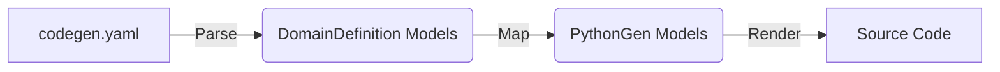

# Feature: Bootstrap 代码生成策略设计 (Revised v3)

## 1. Context

Ref: `docs/architecture/bootstrap_standard.md`
Ref: `docs/design/bootstrap_schema_spec.md`
User Requirement: `Step 24: Manual Revision`

本设计文档详细描述 Bootstrap 层及其相关组件（Config, Container）的代码生成逻辑。
**核心原则**：
1.  **单向数据流**：`codegen.yaml` -> `DomainDefinition` -> `PythonGen` -> Code。
2.  **单一事实来源**：`codegen.yaml` 是唯一真理，不进行 AST 源码扫描。
3.  **模型转换**：通过 Mapper 将业务模型 (`ConfigSpec`, `ContainerSpec`) 转换为代码生成模型 (`PythonGen.ClassSpec`)。

## 2. Data Flow Architecture

*   **DomainDefinition**: 包含 `ConfigSpec`, `ContainerSpec`, `BoundedContext` 等业务语义对象。
*   **PythonGen**: 包含 `ClassSpec`, `FunctionSpec`, `FieldSpec`, `DecoratorSpec` 等代码语义对象。
*   **Mapping Layer**: 负责将业务语义翻译为代码语义 (e.g. "Configuration" -> "Pydantic BaseSettings Class").

## 3. Configuration Generation Strategy

### 3.1 Mapping Logic
**Source**: `DomainDefinition.ConfigSpec`
**Target**: `PythonGen.ClassSpec`

生成器只需负责构建 `ClassSpec`，具体的代码渲染交给 `PythonGen`。

#### Logic
1.  **Class Definition**:
    *   Name: `ConfigSpec.class_name`
    *   Bases: `['pydantic_settings.BaseSettings']`
2.  **Decorator**:
    *   Add `model_config = SettingsConfigDict(...)`. 
    *   *Gap Identification*: PythonGen 需要支持在该类内部定义 `model_config` 属性，或者支持 Pydantic `model_config` 的专用生成语义。
3.  **Fields**:
    *   Iterate `ConfigSpec.fields`.
    *   Map to `PythonGen.FieldSpec`.
    *   Default Value: Handle `Field(...)` vs literal values.

### 3.2 Bootstrap Aggregation
**Source**: `DomainDefinition.BootstrapSpec.config`
**Target**: `PythonGen.ClassSpec` (AppSettings)

1.  **Imports**: 
    *   Add `from {context_package}.config import {ContextSettings}`.
2.  **Fields**:
    *   Global fields mapped directly.
    *   Context fields mapped as nested models: `FieldSpec(name=ctx_name, type=ctx_settings_class, default_factory=ctx_settings_class)`.

## 4. Container Generation Strategy

### 4.1 Integration without AST
**Constraint**: 禁止扫描现有代码推导依赖。
**Solution**: 依赖关系必须在 `codegen.yaml` 中**显示定义**或通过**强约定**推导。

#### Resolution Strategy (Dependency Resolution)
由于不能扫描 `__init__`，我们无法知道一个类需要什么参数。因此，我们必须依赖 `codegen.yaml` 中的定义。

1.  **Convention-based Wiring (DDD Components)**:
    *   对于 `codegen.yaml` 中定义的标准 DDD 组件（如 `Repository`, `DomainService`），我们假设其依赖关系遵循标准构造。
    *   *Issue*: 如果 `Repository` 需要具体的 `SQLAlchemySession`，这一点必须在元模型中可知，或者在 Container 中硬编码标准依赖。
    
2.  **Explicit Wiring (Custom Components)**:
    *   对于非标准组件，必须在 `codegen.yaml` 的 `ContainerSpec.providers` 中显式定义。

### 4.2 Mapping Logic
**Source**: `DomainDefinition.Context` & `ContainerSpec`
**Target**: `PythonGen.ClassSpec` (Container)

1.  **Class Definition**:
    *   Bases: `['dependency_injector.containers.DeclarativeContainer']`
2.  **Providers Generation**:
    *   需要生成形如 `user_service = providers.Factory(UserService, repo=user_repo)` 的代码。
    *   这本质上是 `ClassSpec` 的一个 Field，但其 `default_value` 是一个复杂的函数调用表达式。

## 5. Implementation Gaps & Requirements

为了实现上述纯转换逻辑，我们需要识别当前 `PythonGen` 和 `DomainDefinition` 的不足。请创建以下任务来支持本设计：

### 5.1 PythonGen Layer Gaps
**Task**: Extend PythonGen capabilities
1.  **Complex Field Initializers**:
    *   目前 `PythonGen` 可能仅支持简单的默认值。
    *   **Requirement**: 支持 `Expression` 对象作为默认值，以便生成 `providers.Factory(...)` 或 `Field(default_factory=...)`。
2.  **Inner Class / Meta Config Support**:
    *   Pydantic 2.0 推荐使用 `model_config = SettingsConfigDict(...)` (Class Attribute) 而非 Inner Class。
    *   **Requirement**: 确保 `PythonGen` 能生成复杂的 Class Attribute 赋值。

### 5.2 Codegen YAML Data Population
**Task**: Populate Dependencies in Codegen YAML
由于移除了 AST 扫描，我们必须确保 `codegen.yaml` 中包含完整的依赖信息。

1.  **Populate Service Dependencies**:
    *   Schema 中 `ServiceSpec` 已包含 `dependencies` 字段。
    *   **Action**: 必须检查 `codegen.yaml` 中的 Service 定义，确保 `dependencies` 列表完整，否则生成器无法生成构造函数参数注入。

2.  **ContainerSpec Providers Definitions**:
    *   Schema 中 `ContainerSpec` 的 `providers` 字段目前定义为任意对象列表 (`items: {}`)。
    *   **Action**: 需要在 `codegen.yaml` 中明确 `providers` 的结构约定（如 `name`, `class`, `dependencies`），以便 Mapper 能正确解析。

## 6. Migration Plan

1.  **Phase 1 (Data Population)**:
    *   [Task T1] 审查并补全 `codegen.yaml` 中所有 Service/UseCase 的 `dependencies` 字段。
    *   [Task T2] 在 `codegen.yaml` 中定义 `Bootstrap` 和 `Context` 的 `container.providers` 内容。

2.  **Phase 2 (PythonGen Update)**:
    *   [Task T3] 升级 `PythonGen` 以支持 Expression 渲染和 Pydantic 2.0 风格配置。

3.  **Phase 3 (Logic Implementation)**:
    *   [Task T4] 实现 ConfigMapper (Domain -> PythonGen)。
    *   [Task T5] 实现 ContainerMapper (Domain -> PythonGen)，基于显式依赖生成 wiring 代码。
