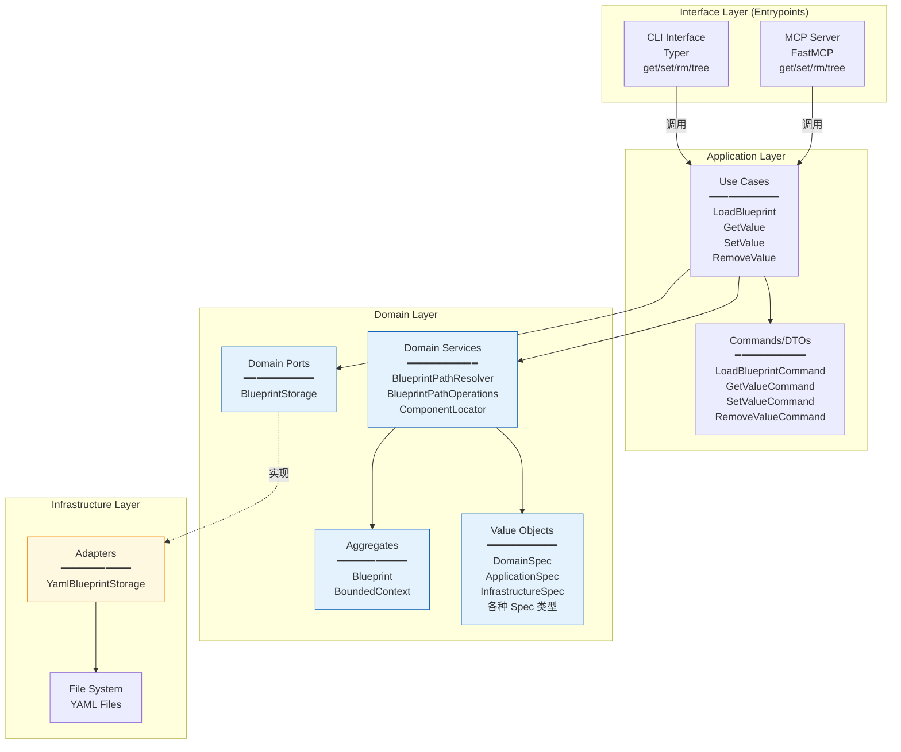

# Domain Definition 上下文架构设计

## 前置确认

- ✅ 战略设计文件：`docs/domain_definition/ddd-strategic.md`
- ✅ 战术领域建模文件：`docs/domain_definition/ddd-tactical.md`
- ✅ 技术选型：CLI + MCP 双入口，YAML 存储

---

## 1. 应用层设计 (Application Layer)

### 用例编排 (Use Cases)

| 用例名称 | 中文名 | 核心逻辑 | 依赖的端口/聚合 | 事务边界 |
|----------|--------|----------|-----------------|----------|
| **LoadBlueprint** | 加载蓝图 | 通过 BlueprintStorage 加载蓝图，返回 Blueprint 对象 | BlueprintStorage | 无事务，只读 |
| **GetValue** | 获取值 | 通过路径表达式查询蓝图中的值 | BlueprintStorage, BlueprintPathOperations | 无事务，只读 |
| **SetValue** | 设置值 | 通过路径表达式设置蓝图中的值，返回新蓝图并持久化 | BlueprintStorage, BlueprintPathOperations | 单次 save 操作 |
| **RemoveValue** | 删除值 | 通过路径表达式删除蓝图中的值，返回新蓝图并持久化 | BlueprintStorage, BlueprintPathOperations | 单次 save 操作 |

### 用例编排原则

1. **一次用例仅操作一个聚合根**：每个用例仅对 Blueprint 进行一次完整的加载-修改-保存周期
2. **不可变更新模式**：使用 Pydantic 的 `model_copy` 方法创建新对象，而非原地修改
3. **路径驱动**：所有操作通过统一的路径表达式语法定位目标

#### 核心编排逻辑

```
┌─────────────────────────────────────────────────────────────────┐
│                        SetValue 用例流程                         │
├─────────────────────────────────────────────────────────────────┤
│  1. storage.load() → Blueprint                                  │
│  2. operations.set_value(blueprint, path, value) → new_blueprint│
│  3. storage.save(new_blueprint)                                 │
└─────────────────────────────────────────────────────────────────┘
```

### 命令与查询分离 (CQRS)

#### 命令 (Commands)

| 命令名称 | 中文名 | 触发场景 | 修改聚合 | 输入参数 |
|----------|--------|----------|----------|----------|
| **SetValueCommand** | 设置值命令 | CLI `set` 命令、MCP `set` 工具 | Blueprint | path: str, value: Any, append: bool |
| **RemoveValueCommand** | 删除值命令 | CLI `rm` 命令、MCP `rm` 工具 | Blueprint | path: str |

#### 查询 (Queries)

| 查询名称 | 中文名 | 查询场景 | 返回数据 | 是否绕过领域层 |
|----------|--------|----------|----------|----------------|
| **LoadBlueprintQuery** | 加载蓝图查询 | 下游上下文调用、`tree` 命令 | Blueprint | 否，通过领域端口 |
| **GetValueQuery** | 获取值查询 | CLI `get` 命令、MCP `get` 工具 | Any（路径处的值） | 否，通过领域服务 |

#### CQRS 实现策略

- **命令**：通过领域服务 `BlueprintPathOperations` 执行不可变修改，返回新对象
- **查询**：直接通过领域服务解析路径，不修改状态
- **读写分离**：命令和查询共用同一个 BlueprintStorage，但命令触发持久化，查询不触发

### 事务与安全边界

| 边界类型 | 说明 |
|----------|------|
| **事务边界** | 每个 Command 用例是一个事务单元，包含 load → modify → save 三个操作 |
| **一致性保证** | 通过不可变更新模式，确保并发读取不会读到部分修改的状态 |
| **跨聚合一致性** | 不涉及跨聚合操作（本上下文只有一个根聚合 Blueprint） |

---

## 2. 接口层设计 (Interface Layer)

> **说明**：DomainDefinition 上下文的接口通过 InterfaceSpec 定义在 Entrypoints 层中直接暴露。跨上下文编排的接口（如 `build`、`reverse`）由 Orchestration 上下文统一暴露。

### Entrypoints（直接接口）

以下接口允许用户直接操作蓝图（查询、修改、删除），属于 DomainDefinition 上下文：

#### CLI（命令行接口）

**实现框架**：Typer

| CLI 命令 | 中文名 | 功能说明 | 参数列表 | 对应应用层用例 |
|----------|--------|----------|----------|----------------|
| `get` | 获取 | 查询蓝图指定路径的值 | `path`, `--config`, `--format` | GetValue |
| `set` | 设置 | 设置蓝图指定路径的值 | `path`, `value`, `--append`, `--config`, `--kv` | SetValue |
| `rm` | 删除 | 删除蓝图指定路径的值 | `path`, `--config` | RemoveValue |
| `tree` | 树形展示 | 以树形结构展示蓝图 | `--config`, `--path`, `--depth`, `--detail` | LoadBlueprint + GetValue |

#### MCP（Model Context Protocol）

**实现框架**：FastMCP

| MCP 工具 | 中文名 | 功能说明 | 参数列表 | 对应应用层用例 |
|----------|--------|----------|----------|----------------|
| `tree` | 树形展示 | 以树形结构展示蓝图 | `work_dir`, `config_file`, `path`, `depth`, `detail` | LoadBlueprint + GetValue |
| `get` | 获取 | 查询蓝图指定路径的值 | `work_dir`, `path`, `config_file`, `output_format` | GetValue |
| `set` | 设置 | 设置蓝图指定路径的值 | `work_dir`, `path`, `value`, `config_file`, `append` | SetValue |
| `rm` | 删除 | 删除蓝图指定路径的值 | `work_dir`, `path`, `config_file` | RemoveValue |

### 契约设计 (Contracts/DTOs)

**实现框架**：Pydantic (dataclass)

| DTO 名称 | 中文名 | 用途 | 核心属性 |
|----------|--------|------|----------|
| **LoadBlueprintCommand** | 加载蓝图命令 | 输入 | `node: str \| None` |
| **LoadBlueprintResult** | 加载蓝图结果 | 输出 | `blueprint: Blueprint` |
| **GetValueCommand** | 获取值命令 | 输入 | `path: str` |
| **SetValueCommand** | 设置值命令 | 输入 | `path: str`, `value: Any`, `append: bool` |
| **RemoveValueCommand** | 删除值命令 | 输入 | `path: str` |

**设计原则**：
- DTO 仅用于数据传输，不包含业务逻辑
- 使用 `frozen=True` 的 dataclass 确保不可变性
- 与领域实体严格分离

---

## 3. 基础设施层设计 (Infrastructure Layer)

### 端口与适配器映射 (Ports & Adapters)

| 领域层 Port | 中文名 | 基础设施层 Adapter | 底层依赖 | 说明 |
|-------------|--------|---------------------|----------|------|
| **BlueprintStorage** | 蓝图存储端口 | YamlBlueprintStorage | YAML 文件系统 | 使用 PyYAML 解析，Pydantic 验证 |

#### BlueprintStorage 适配器详情

```python
class YamlBlueprintStorage(BlueprintStorage):
    """YAML 文件存储适配器"""

    # 依赖注入配置
    config: {
        "config_path": Path  # codegen.yaml 路径
    }

    # 实现方法
    def load() -> Blueprint | None:
        # 1. 读取 YAML 文件
        # 2. 使用 Pydantic model_validate 解析为 Blueprint

    def save(blueprint: Blueprint) -> None:
        # 1. 使用 model_dump 序列化
        # 2. 写入 YAML 文件，附带 schema 引用注释
```

### 外部服务适配

**无外部服务依赖**。本上下文的所有操作都在本地文件系统完成。

### 技术组件落地

| 技术组件 | 选型 | 用途 | 配置方式 |
|----------|------|------|----------|
| **依赖注入容器** | dependency-injector | 管理用例、服务、适配器的生命周期 | `DeclarativeContainer` |
| **数据验证** | Pydantic | 蓝图模型定义与验证 | `BaseModel` + `model_validate` |
| **配置管理** | Pydantic Settings | CLI 参数解析与配置 | Typer Options |
| **日志** | Python logging | 操作日志记录 | 标准 logging 模块 |

---

## 4. 架构总览图



### 依赖方向

```
┌──────────────────────────────────────────────────────────────────┐
│                         Interface Layer                           │
│                     (CLI, MCP Server)                            │
└────────────────────────────┬─────────────────────────────────────┘
                             │ 依赖
                             ▼
┌──────────────────────────────────────────────────────────────────┐
│                        Application Layer                          │
│               (Use Cases, Commands, DTOs)                        │
└────────────────────────────┬─────────────────────────────────────┘
                             │ 依赖
                             ▼
┌──────────────────────────────────────────────────────────────────┐
│                          Domain Layer                             │
│       (Blueprint, Specs, Services, Ports)                        │
└──────────────────────────────────────────────────────────────────┘
                             ▲
                             │ 实现接口
┌────────────────────────────┴─────────────────────────────────────┐
│                      Infrastructure Layer                         │
│                    (YamlBlueprintStorage)                        │
└──────────────────────────────────────────────────────────────────┘
```

---

## 5. 依赖注入配置

### 容器定义 (Container)

```python
class Container(DeclarativeContainer):
    config = providers.Configuration()

    # 基础设施层
    blueprint_storage = Singleton(YamlBlueprintStorage, config=config)

    # 领域服务
    path_resolver = Singleton(BlueprintPathResolver)
    path_operations = Singleton(
        BlueprintPathOperations,
        resolver=path_resolver,
    )

    # 应用层用例
    load_blueprint = Factory(LoadBlueprint, blueprint_loader=blueprint_storage)
    get_value = Factory(GetValue, storage=blueprint_storage, operations=path_operations)
    set_value = Factory(SetValue, storage=blueprint_storage, operations=path_operations)
    remove_value = Factory(RemoveValue, storage=blueprint_storage, operations=path_operations)
```

### 生命周期策略

| 组件类型 | 生命周期 | 说明 |
|----------|----------|------|
| **BlueprintStorage** | Singleton | 全局共享同一个存储实例 |
| **Domain Services** | Singleton | 无状态服务，全局共享 |
| **Use Cases** | Factory | 每次请求创建新实例，支持并发 |

---

## 6. 架构设计决策记录

### 决策 1：双入口设计（CLI + MCP）

**背景**：工具需要同时支持开发者手动操作和 LLM 自动化调用。

**决策**：同时提供 CLI（Typer）和 MCP（FastMCP）两种接口。

**理由**：
- CLI 适合开发者日常使用，命令行体验友好
- MCP 适合 LLM 集成，支持 Claude 等 AI 工具直接调用
- 共享相同的应用层用例，保证行为一致性

### 决策 2：路径表达式作为核心 API

**背景**：蓝图结构复杂，需要灵活的查询和修改能力。

**决策**：所有操作通过统一的路径表达式（如 `contexts.DomainDefinition.domain.aggregates`）定位目标。

**理由**：
- 简化接口设计，避免为每种操作定义专门的方法
- 支持嵌套访问和索引访问
- 易于 CLI 传参和 MCP 工具定义

### 决策 3：不可变更新模式

**背景**：蓝图修改需要保证数据一致性。

**决策**：使用 Pydantic 的 `model_copy(update={...})` 方法创建新对象，而非原地修改。

**理由**：
- 符合值对象不可变性原则
- 避免并发读取时的数据竞争
- 便于实现撤销/重做功能

### 决策 4：YAML 作为存储格式

**背景**：蓝图需要人类可读、易于版本控制。

**决策**：使用 YAML 格式存储蓝图文件。

**理由**：
- 人类可读，支持注释
- 原生支持复杂嵌套结构
- 可通过 JSON Schema 提供编辑器支持
- Git 友好，便于 diff 和 merge

---

*文档版本：1.0*
*创建日期：2026-03-20*
*基于代码反向工程生成*