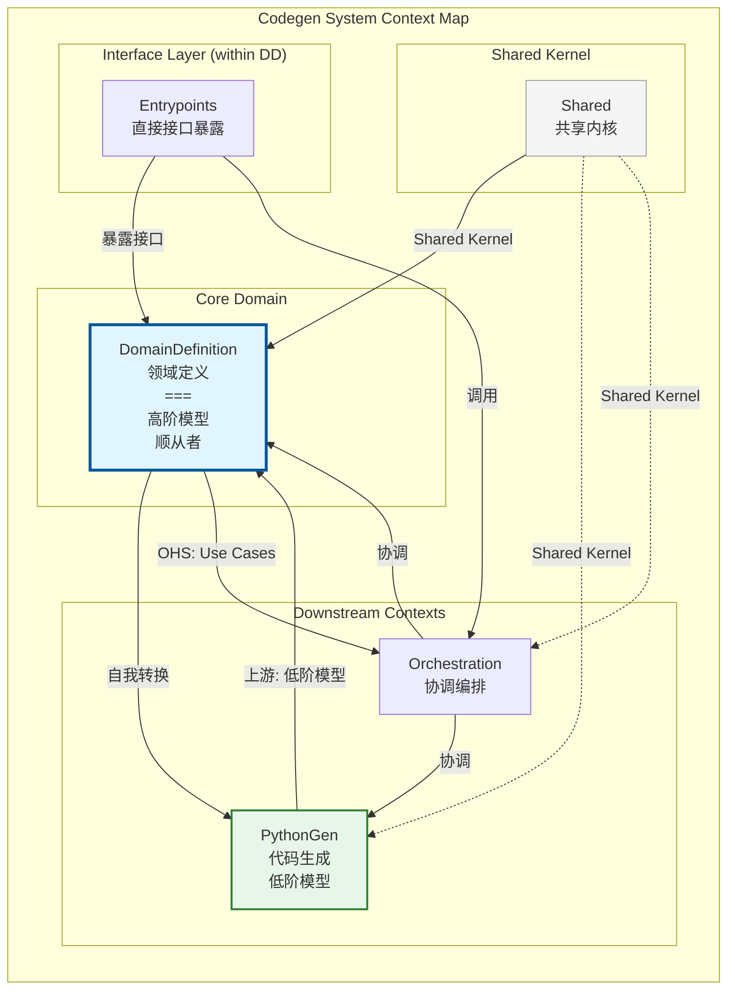

# Domain Definition 上下文战略设计

## 1. 上下文命名与核心愿景

### 上下文名称 (Name)
**DomainDefinition** (领域定义)

### 核心职责 (Core Responsibility)
解析和管理领域定义蓝图（`codegen.yaml`），作为代码生成的**单一数据源**。负责将声明式的领域架构描述转化为可操作的领域模型对象，并**自我转换为 PythonGen 模型**（PackageSpec/ModuleSpec），成为"顺从的自我描述者"。

### 问题陈述 (Problem Statement)
在 DDD 项目中，架构设计与代码实现往往存在"两张皮"问题——设计文档与代码逐渐脱节。`DomainDefinition` 上下文通过引入 YAML 蓝图作为"活文档"，让领域架构以声明式方式定义，并作为代码生成的权威输入，确保设计与实现的强制同步。

更重要的是，在架构演进中，DomainDefinition 需要具备**自我转换为下游模型的能力**——它知道自己的领域对象如何被渲染为 PythonGen 的 PackageSpec，而不是将这份知识泄露到 Orchestration 上下文。

### 业务价值
- **一致性保证**：蓝图即规范，生成代码必然符合蓝图定义
- **可追溯性**：所有架构变更都有版本控制的 YAML 记录
- **降低认知负担**：开发者只需关注蓝图定义，无需手写模板代码
- **自我可描述性**：DomainDefinition 具备"将自己渲染为 PythonGen 模型"的顺从者能力

---

## 2. 统一语言词汇表

| 术语 | 中文名 | 业务定义 |
|------|--------|----------|
| **Blueprint** | 蓝图 | 整个项目的领域定义根容器，是代码生成的唯一输入源 |
| **Bounded Context** | 限界上下文 | 系统的逻辑边界，拥有独立的领域模型和统一语言 |
| **Domain Spec** | 领域规范 | 领域层的完整定义，包含聚合、实体、值对象、服务、端口等构建块 |
| **Application Spec** | 应用规范 | 应用层的定义，包含用例、应用服务、端口等 |
| **Infrastructure Spec** | 基础设施规范 | 基础设施层的定义，包含端口的具体实现 |
| **Interface Spec** | 接口规范 | 接口层的定义，包含 CLI、MCP、HTTP 等外部入口配置 |
| **Spec** | 规范 | 某个领域构建块的描述性定义（如 EntitySpec、ValueObjectSpec） |
| **Aggregate** | 聚合 | 一组相关对象的集合，作为数据修改的单元，由聚合根控制边界 |
| **Entity** | 实体 | 由身份标识而非属性定义的对象，在生命周期内身份不变 |
| **Value Object** | 值对象 | 无唯一身份的对象，由其属性值完全定义，不可变 |
| **Port** | 端口 | 领域与外部世界的接口抽象，定义"需要什么能力" |
| **Adapter** | 适配器 | 端口的具体实现，将领域与具体技术解耦 |
| **Use Case** | 用例 | 代表一个业务操作，分为 Command（命令）和 Query（查询） |
| **Attribute** | 属性 | 类的成员变量定义，包含名称、类型、是否可选等 |
| **Behavior** | 行为 | 类的方法定义，包含名称、输入参数、输出类型 |
| **Naming String** | 命名字符串 | 支持多种命名风格转换的字符串类型（Pascal、snake、camel 等） |
| **Container** | 容器类型 | 属性的容器类型（None, List, Set, Map, Iterable, Callable） |

### 关键区别说明

1. **Spec vs 实际领域对象**：
   - `EntitySpec` 是对实体的"描述"，是蓝图中的数据
   - 实际的 `Entity` 类由 `python_gen` 上下文生成

2. **Port vs Adapter**：
   - `PortSpec` 定义在领域层，描述"我需要什么能力"
   - `ImplementationSpec` 定义在基础设施层，描述"这个能力如何实现"

3. **Use Case 的分类**：
   - **Command**：改变状态的命令操作（如 `CreateUser`）
   - **Query**：查询数据的只读操作（如 `GetUser`）

---

## 3. 上下文映射与集成

### 3.1 协作关系

| 上下游关系 | 对方上下文 | 集成模式 | 说明 |
|------------|------------|----------|------|
| **上游 (Upstream)** | Shared | Shared Kernel | 共享基础类型、命名字符串、端口抽象 |
| **上游 (Upstream)** | PythonGen | **顺从者 (Conformist)** | DomainDefinition 是高阶模型，依赖 PythonGen 的低阶模型，具备自我转换为 PythonGen 模型的能力 |
| **下游 (Downstream)** | Orchestration | Open Host Service | 提供用例接口加载和操作蓝图 |
| **接口层** | Entrypoints | 接口暴露层 | 属于 DomainDefinition 上下文的 InterfaceSpec 层，暴露 CLI/MCP 接口供直接操作蓝图（如 get/set/rm 命令） |

### 3.2 上下文映射图



### 3.3 集成模式详解

#### 与 Shared 的关系：Shared Kernel（共享内核）

- **共享内容**：
  - 基础类型：`ValueObject`、`Entity`、`AggregateRoot`
  - 命名字符串：`PascalString`、`SnakeString`、`NamingString`
  - 端口抽象：`FileSystemPort`、`TemplatePort`
  - 通用枚举：`ContainerType`

- **依赖方式**：直接导入 Python 模块
  ```python
  from codegen.shared.domain.value_objects import PascalString
  from codegen.shared.models import ValueObject
  ```

- **变更协调**：Shared 的变更需要所有消费方同意

#### 与 PythonGen 的关系：顺从者（Conformist）

- **关系说明**：PythonGen 定义了低阶模型（PackageSpec、ModuleSpec 等），DomainDefinition 依赖这些模型并具备自我转换为低阶模型的能力

- **DomainDefinition 作为顺从者**：
  - 依赖 PythonGen 定义的 PackageSpec、ModuleSpec、ClassSpec 等低阶模型
  - 自我实现"将 Spec 转换为 PackageSpec"的逻辑（转换知识沉淀在 DomainDefinition）
  - 可逆向解析 PythonGen 模型回补自身的 Spec

- **数据流向**：
  - 正向：DomainDefinition Spec → 自我转换 → PackageSpec → PythonGen → Python Source
  - 逆向：Python Source → PythonGen → PackageSpec → 自我解析 → DomainDefinition Spec

#### 与 Orchestration 的关系：Open Host Service

- **服务内容**：
  - `LoadBlueprint`：加载蓝图
  - `GetValue`：查询蓝图中的值
  - `SetValue`：修改蓝图中的值
  - `RemoveValue`：删除蓝图中的值

- **调用方式**：通过依赖注入容器

#### 与 Entrypoints 的关系：接口暴露层

- **Entrypoints** 是 DomainDefinition 上下文内的接口暴露层，不是一个独立的限界上下文
- **InterfaceSpec** 定义了 CLI、MCP、HTTP 等接口配置
- **直接接口**：通过 Entrypoints 暴露的接口允许用户直接操作蓝图（如 `get`、`set`、`rm`、`tree` 命令）
- **编排接口**：跨上下文操作（如 `build`、`reverse`）由 Orchestration 通过调用 DomainDefinition 的用例实现

### 3.4 防腐层（ACL）说明

`DomainDefinition` 作为核心上下文，通过**顺从者模式**直接依赖 PythonGen 的低阶模型，这是合理的架构决策——DomainDefinition 作为高阶模型，理应知道如何转换为低阶模型。转换知识沉淀在 DomainDefinition 内部，不会泄露到 Orchestration。

---

## 4. 战略设计决策记录

### 决策 1：蓝图作为单一数据源

**背景**：代码生成工具需要明确的输入源。

**决策**：`codegen.yaml` 是唯一的数据源，所有代码生成都必须基于蓝图。

**理由**：
- 避免多源导致的不一致
- YAML 格式人类可读，便于版本控制
- 可以通过 JSON Schema 进行严格验证

### 决策 2：Spec 类型作为值对象

**背景**：领域定义中的各种规范如何建模？

**决策**：所有 `Spec` 类型（`EntitySpec`、`ValueObjectSpec` 等）都作为不可变值对象。

**理由**：
- 值对象的不可变性保证蓝图稳定性
- 便于比较和验证
- 符合函数式编程原则

### 决策 3：命名类型作为共享内核

**背景**：命名风格转换是跨上下文的通用需求。

**决策**：`PascalString`、`SnakeString`、`NamingString` 放在 `Shared` 上下文。

**理由**：
- 多个上下文都需要命名转换能力
- 避免重复实现
- 统一命名规范

---

## 5. 未来演进方向

### 5.1 潜在的战略变更

1. **蓝图版本迁移**：支持蓝图 Schema 的版本升级和迁移
2. **多格式支持**：除 YAML 外，支持 JSON、TOML 等格式
3. **蓝图验证规则**：引入更丰富的业务规则验证

### 5.2 与其他上下文的演进协调

- **PythonGen**：如增加新的目标语言，需协调 `Spec` 类型的扩展
- **Shared**：如命名类型需要新的转换规则，需在共享内核中统一变更

---

*文档版本：1.1*
*创建日期：2026-03-20*
*最后修改：2026-03-21*
*基于代码反向工程生成*

### 修改记录

| 日期 | 修改人 | 修改内容 |
|------|--------|----------|
| 2026-03-21 | Claude | 确立 DomainDefinition 与 PythonGen 的顺从者关系；DomainDefinition 作为高阶模型具备自我转换为 PythonGen 低阶模型的能力 |