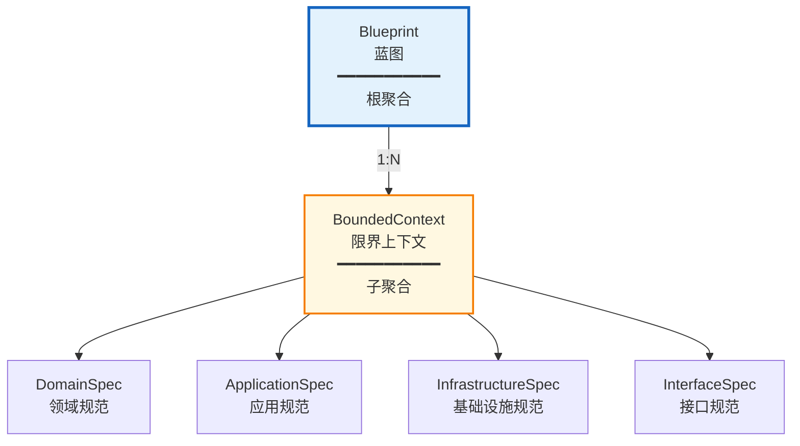
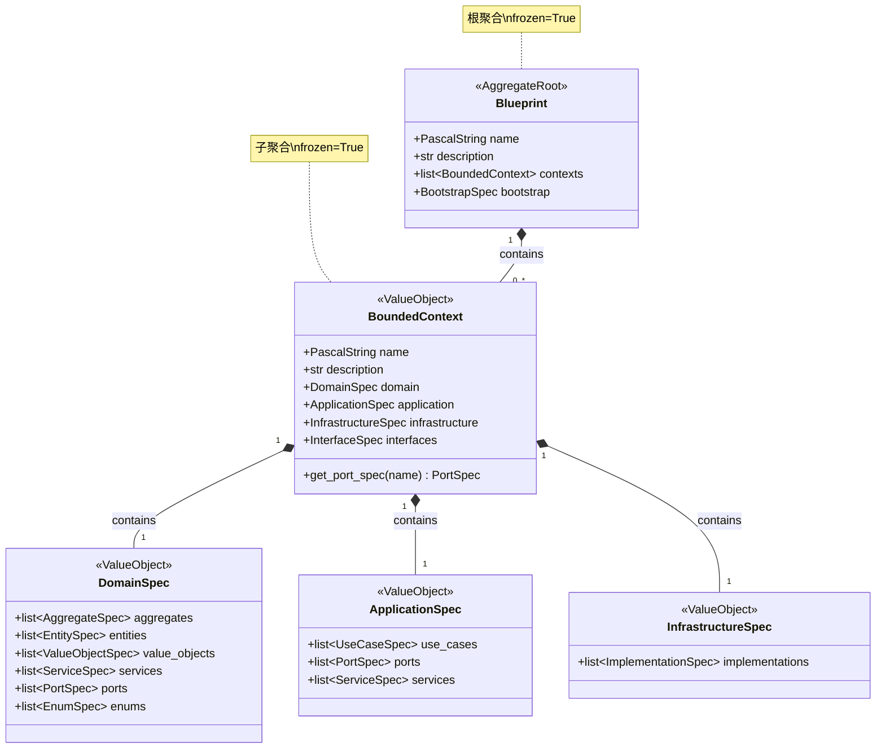

# Domain Definition 上下文战术设计

## 前置确认

- ✅ 战略设计文件已锁定：`docs/domain_definition/ddd-strategic.md`
- ✅ 上下文名称：DomainDefinition（领域定义）
- ✅ 核心目标：为保证蓝图与代码生成的强制同步，建立一套完整的领域模型规范体系

---

## 1. 聚合与聚合根

### 聚合划分原则

本次聚合划分基于**层级结构内聚性**：
- `Blueprint` 作为项目级根聚合，承载整体蓝图的完整性约束
- `BoundedContext` 作为子聚合，承载单个限界上下文的完整性约束
- 两者形成严格的层级关系，确保蓝图结构的一致性

### 聚合根列表

| 聚合根名称 | 中文名 | 核心职责 | 一致性边界说明 |
|------------|--------|----------|----------------|
| **Blueprint** | 蓝图 | 作为项目级根聚合，维护整个领域定义的完整性和一致性 | 包含所有 `BoundedContext`，确保项目名称唯一、上下文列表完整 |
| **BoundedContext** | 限界上下文 | 作为子聚合，维护单个上下文的领域层、应用层、基础设施层规范完整性 | 包含 `DomainSpec`、`ApplicationSpec`、`InfrastructureSpec`，确保上下文内构建块定义完整 |

### 聚合关系

**关联方式**：
- `Blueprint` 通过 `contexts: list[BoundedContext]` 持有子聚合引用
- 子聚合通过层级嵌套（而非 ID 引用）与根聚合关联
- 这是**组合关系**：`BoundedContext` 不能独立于 `Blueprint` 存在

---

## 2. 实体与值对象

### 实体

**本上下文无实体。**

**原因说明**：
- 所有领域对象都是"规范描述"（Spec），其本质是配置数据的结构化表示
- 规范对象由其属性值完全定义，无生命周期状态变化
- 符合值对象的不可变性原则，确保蓝图稳定性

### 值对象

#### 层级结构值对象

| 值对象名称 | 中文名 | 所属聚合 | 核心属性 | 不可变性规则 | 业务校验规则 |
|------------|--------|----------|----------|--------------|--------------|
| **DomainSpec** | 领域规范 | BoundedContext | aggregates, entities, value_objects, services, ports, enums | Pydantic frozen=True，创建后不可修改 | 各列表内元素不可重复（按 name） |
| **ApplicationSpec** | 应用规范 | BoundedContext | use_cases, ports, services | frozen=True | use_cases 内 name 唯一 |
| **InfrastructureSpec** | 基础设施规范 | BoundedContext | implementations | frozen=True | implementations 内 name 唯一 |
| **InterfaceSpec** | 接口规范 | BoundedContext | cli, mcp, http | frozen=True | 各接口类型可选，互不影响 |

#### 构建块规范值对象

| 值对象名称 | 中文名 | 所属聚合/实体 | 核心属性 | 不可变性规则 | 业务校验规则 |
|------------|--------|---------------|----------|--------------|--------------|
| **AggregateSpec** | 聚合规范 | DomainSpec | name, description, attributes, behaviors | frozen=True | name 必须为 PascalString |
| **EntitySpec** | 实体规范 | DomainSpec | name, description, attributes, behaviors | frozen=True | name 必须为 PascalString |
| **ValueObjectSpec** | 值对象规范 | DomainSpec | name, description, attributes, behaviors | frozen=True | name 必须为 PascalString |
| **EnumSpec** | 枚举规范 | DomainSpec | name, description, members | frozen=True | members 至少包含一个成员 |
| **ServiceSpec** | 服务规范 | DomainSpec, ApplicationSpec | name, description, dependencies, operations | frozen=True | name 必须为 PascalString |
| **PortSpec** | 端口规范 | DomainSpec, ApplicationSpec | name, kind, aggregate, operations | frozen=True | kind 必须为 PortType 枚举值 |
| **UseCaseSpec** | 用例规范 | ApplicationSpec | name, kind, dependencies, command, query, result | frozen=True | kind 必须为 UseCaseKind 枚举值 |
| **ImplementationSpec** | 实现规范 | InfrastructureSpec | name, implements, technology, attributes, private_methods | frozen=True | implements 必须指向已定义的 Port |

#### 支撑值对象

| 值对象名称 | 中文名 | 所属聚合/实体 | 核心属性 | 不可变性规则 | 业务校验规则 |
|------------|--------|---------------|----------|--------------|--------------|
| **AttributeSpec** | 属性规范 | 各 Spec 类型 | name, type, container, optional, default | frozen=True | name 必须为 SnakeString |
| **MethodSpec** | 方法规范 | 各 Spec 类型 | name, inputs, output | frozen=True | name 必须为 SnakeString |
| **MethodOutput** | 方法输出 | MethodSpec | type, container, optional | frozen=True | - |
| **TypeDefinition** | 类型定义 | (基类) | type, container, optional, custom_type_string | frozen=True | - |
| **EnumMemberSpec** | 枚举成员 | EnumSpec | name, value, description | frozen=True | name 和 value 必填 |
| **DataContractSpec** | 数据契约 | UseCaseSpec | attributes | frozen=True | - |
| **PortBinding** | 端口绑定 | ContainerSpec | port, implementation | frozen=True | 必须指向有效的 port 和 implementation |

### 为何都是值对象？

| 对象类型 | 为何是值对象 |
|----------|--------------|
| **所有 Spec 类型** | 它们是"对目标代码的描述"，本质是配置数据。由属性值完全定义，无唯一身份，生命周期内不可变 |
| **Blueprint** | 虽然是聚合根，但采用值对象实现（frozen=True）。通过"整体替换"而非"部分修改"来保证一致性 |
| **BoundedContext** | 同 Blueprint，采用值对象实现。作为子聚合，其完整性由父聚合保证 |

---

## 3. 领域事件

**本上下文当前未定义领域事件。**

**原因说明**：
1. **纯读模型**：DomainDefinition 上下文的职责是"解析和管理蓝图"，核心操作是加载、查询、修改蓝图数据，而非业务状态流转
2. **同步操作**：蓝图的修改（SetValue、RemoveValue）是同步完成的命令操作，无需事件驱动
3. **下游消费模式**：下游上下文（PythonGen、Orchestration）通过主动调用 UseCase 获取蓝图数据，而非订阅事件

**潜在扩展**：
- 若未来需要支持"蓝图变更通知"（如热重载），可引入 `BlueprintChanged` 事件
- 若需要审计追踪，可引入 `BlueprintModified` 事件记录变更历史

---

## 4. 领域服务

| 服务名称 | 中文名 | 核心逻辑 | 依赖聚合 | 无状态说明 |
|----------|--------|----------|----------|------------|
| **BlueprintPathResolver** | 蓝图路径解析器 | 解析路径表达式（如 `contexts[0].name`），在蓝图对象中定位目标值 | Blueprint | 纯函数，无状态，输入路径字符串返回解析结果 |
| **BlueprintPathOperations** | 蓝图路径操作器 | 在蓝图指定路径上执行取值、设值、删除操作 | Blueprint | 无状态，所有方法接收 Blueprint 作为参数 |
| **ComponentLocator** | 组件定位器 | 在 BoundedContext 中按类型和名称查找构建块（aggregate, entity, port 等） | BoundedContext | 无状态，基于查找表实现 |

**领域服务存在原因**：
- `BlueprintPathResolver`：跨层路径解析逻辑复杂，不适合放在聚合根内
- `ComponentLocator`：需要在 DomainSpec 和 ApplicationSpec 两层查找 Port，属于跨子聚合逻辑

---

## 5. 领域端口

| 端口名称 | 中文名 | 所属聚合 | 核心契约职责 |
|----------|--------|----------|--------------|
| **BlueprintStorage** | 蓝图存储端口 | Blueprint | 定义蓝图的持久化契约：`load()` 加载蓝图、`save(blueprint)` 保存蓝图 |

### 端口详细定义

#### BlueprintStorage（蓝图存储端口）

| 操作 | 输入 | 输出 | 说明 |
|------|------|------|------|
| `load()` | 无 | `Blueprint \| None` | 从存储介质加载蓝图，若不存在返回 None |
| `save(blueprint)` | `Blueprint` | `None` | 将蓝图持久化到存储介质 |

**技术实现**：
- 基础设施层提供 `YamlBlueprintStorage` 实现，将蓝图存储为 YAML 文件
- 遵循端口-适配器模式，领域层不依赖具体存储技术

---

## 6. 领域模型总览图

---

## 7. 战术设计决策记录

### 决策 1：聚合根采用值对象实现

**背景**：Blueprint 和 BoundedContext 是聚合根，通常聚合根应该是实体。

**决策**：采用 `frozen=True` 的 Pydantic 模型实现，作为不可变值对象。

**理由**：
- 蓝图是配置数据，不应有部分修改，只能整体替换
- 值对象的不可变性天然保证蓝图的一致性
- 简化了并发访问的复杂性

### 决策 2：不定义领域事件

**背景**：DDD 通常建议聚合状态变更时发布领域事件。

**决策**：当前不定义领域事件。

**理由**：
- 本上下文是"配置管理"性质，非"业务流程"性质
- 下游通过主动拉取（而非被动推送）获取蓝图数据
- 简化设计，避免过度工程化

### 决策 3：PortSpec 支持 Repository 类型自动生成操作

**背景**：Repository 类型的 Port 通常需要标准的 CRUD 操作。

**决策**：当 `PortSpec.kind = PortType.REPOSITORY` 且指定 `aggregate` 时，自动生成 `save`、`delete`、`find_by_id` 操作。

**理由**：
- 减少蓝图中重复定义
- 约定优于配置，提升开发效率
- 可通过显式定义同名操作来覆盖默认行为

---

*文档版本：1.0*
*创建日期：2026-03-20*
*基于代码反向工程生成*