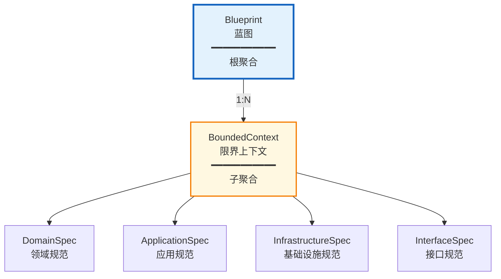
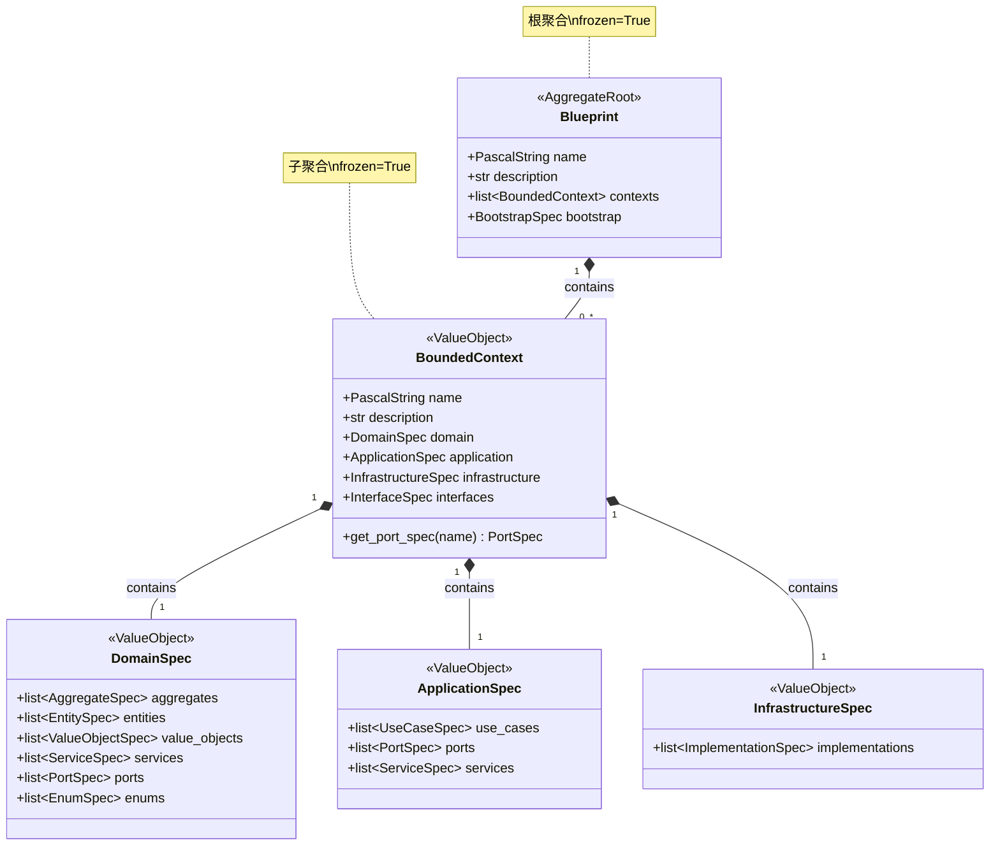

# Domain Definition 上下文战术设计

## 前置确认

- ✅ 战略设计文件已锁定：`docs/domain_definition/ddd-strategic.md`
- ✅ 上下文名称：DomainDefinition（领域定义）
- ✅ 核心目标：为保证蓝图与代码生成的强制同步，建立一套完整的领域模型规范体系

---

## 1. 聚合与聚合根

### 聚合划分原则

本次聚合划分基于**层级结构内聚性**：
- `Blueprint` 作为项目级根聚合，承载整体蓝图的完整性约束
- `BoundedContext` 作为子聚合，承载单个限界上下文的完整性约束
- 两者形成严格的层级关系，确保蓝图结构的一致性

### 聚合根列表

| 聚合根名称 | 中文名 | 核心职责 | 一致性边界说明 |
|------------|--------|----------|----------------|
| **Blueprint** | 蓝图 | 作为项目级根聚合，维护整个领域定义的完整性和一致性 | 包含所有 `BoundedContext`，确保项目名称唯一、上下文列表完整 |
| **BoundedContext** | 限界上下文 | 作为子聚合，维护单个上下文的领域层、应用层、基础设施层规范完整性 | 包含 `DomainSpec`、`ApplicationSpec`、`InfrastructureSpec`，确保上下文内构建块定义完整 |

### 聚合关系

**关联方式**：
- `Blueprint` 通过 `contexts: list[BoundedContext]` 持有子聚合引用
- 子聚合通过层级嵌套（而非 ID 引用）与根聚合关联
- 这是**组合关系**：`BoundedContext` 不能独立于 `Blueprint` 存在

---

## 2. 实体与值对象

### 实体

**本上下文无实体。**

**原因说明**：
- 所有领域对象都是"规范描述"（Spec），其本质是配置数据的结构化表示
- 规范对象由其属性值完全定义，无生命周期状态变化
- 符合值对象的不可变性原则，确保蓝图稳定性

### 值对象

#### 层级结构值对象

| 值对象名称 | 中文名 | 所属聚合 | 核心属性 | 不可变性规则 | 业务校验规则 |
|------------|--------|----------|----------|--------------|--------------|
| **DomainSpec** | 领域规范 | BoundedContext | aggregates, entities, value_objects, services, ports, enums | Pydantic frozen=True，创建后不可修改 | 各列表内元素不可重复（按 name） |
| **ApplicationSpec** | 应用规范 | BoundedContext | use_cases, ports, services | frozen=True | use_cases 内 name 唯一 |
| **InfrastructureSpec** | 基础设施规范 | BoundedContext | implementations | frozen=True | implementations 内 name 唯一 |
| **InterfaceSpec** | 接口规范 | BoundedContext | cli, mcp, http | frozen=True | 各接口类型可选，互不影响 |

#### 构建块规范值对象

| 值对象名称 | 中文名 | 所属聚合/实体 | 核心属性 | 不可变性规则 | 业务校验规则 |
|------------|--------|---------------|----------|--------------|--------------|
| **AggregateSpec** | 聚合规范 | DomainSpec | name, description, attributes, behaviors | frozen=True | name 必须为 PascalString |
| **EntitySpec** | 实体规范 | DomainSpec | name, description, attributes, behaviors | frozen=True | name 必须为 PascalString |
| **ValueObjectSpec** | 值对象规范 | DomainSpec | name, description, attributes, behaviors | frozen=True | name 必须为 PascalString |
| **EnumSpec** | 枚举规范 | DomainSpec | name, description, members | frozen=True | members 至少包含一个成员 |
| **ServiceSpec** | 服务规范 | DomainSpec, ApplicationSpec | name, description, dependencies, operations | frozen=True | name 必须为 PascalString |
| **PortSpec** | 端口规范 | DomainSpec, ApplicationSpec | name, kind, aggregate, operations | frozen=True | kind 必须为 PortType 枚举值 |
| **UseCaseSpec** | 用例规范 | ApplicationSpec | name, kind, dependencies, command, query, result | frozen=True | kind 必须为 UseCaseKind 枚举值 |
| **ImplementationSpec** | 实现规范 | InfrastructureSpec | name, implements, technology, attributes, private_methods | frozen=True | implements 必须指向已定义的 Port |

#### 支撑值对象

| 值对象名称 | 中文名 | 所属聚合/实体 | 核心属性 | 不可变性规则 | 业务校验规则 |
|------------|--------|---------------|----------|--------------|--------------|
| **AttributeSpec** | 属性规范 | 各 Spec 类型 | name, type, container, optional, default | frozen=True | name 必须为 SnakeString |
| **MethodSpec** | 方法规范 | 各 Spec 类型 | name, inputs, output | frozen=True | name 必须为 SnakeString |
| **MethodOutput** | 方法输出 | MethodSpec | type, container, optional | frozen=True | - |
| **TypeDefinition** | 类型定义 | (基类) | type, container, optional, custom_type_string | frozen=True | - |
| **EnumMemberSpec** | 枚举成员 | EnumSpec | name, value, description | frozen=True | name 和 value 必填 |
| **DataContractSpec** | 数据契约 | UseCaseSpec | attributes | frozen=True | - |
| **PortBinding** | 端口绑定 | ContainerSpec | port, implementation | frozen=True | 必须指向有效的 port 和 implementation |

### 为何都是值对象？

| 对象类型 | 为何是值对象 |
|----------|--------------|
| **所有 Spec 类型** | 它们是"对目标代码的描述"，本质是配置数据。由属性值完全定义，无唯一身份，生命周期内不可变 |
| **Blueprint** | 虽然是聚合根，但采用值对象实现（frozen=True）。通过"整体替换"而非"部分修改"来保证一致性 |
| **BoundedContext** | 同 Blueprint，采用值对象实现。作为子聚合，其完整性由父聚合保证 |

---

## 3. 领域事件

**本上下文当前未定义领域事件。**

**原因说明**：
1. **纯读模型**：DomainDefinition 上下文的职责是"解析和管理蓝图"，核心操作是加载、查询、修改蓝图数据，而非业务状态流转
2. **同步操作**：蓝图的修改（SetValue、RemoveValue）是同步完成的命令操作，无需事件驱动
3. **下游消费模式**：下游上下文（PythonGen、Orchestration）通过主动调用 UseCase 获取蓝图数据，而非订阅事件

**潜在扩展**：
- 若未来需要支持"蓝图变更通知"（如热重载），可引入 `BlueprintChanged` 事件
- 若需要审计追踪，可引入 `BlueprintModified` 事件记录变更历史

---

## 4. 领域服务

| 服务名称 | 中文名 | 核心逻辑 | 依赖聚合 | 无状态说明 |
|----------|--------|----------|----------|------------|
| **BlueprintPathResolver** | 蓝图路径解析器 | 解析路径表达式（如 `contexts[0].name`），在蓝图对象中定位目标值 | Blueprint | 纯函数，无状态，输入路径字符串返回解析结果 |
| **BlueprintPathOperations** | 蓝图路径操作器 | 在蓝图指定路径上执行取值、设值、删除操作 | Blueprint | 无状态，所有方法接收 Blueprint 作为参数 |
| **ComponentLocator** | 组件定位器 | 在 BoundedContext 中按类型和名称查找构建块（aggregate, entity, port 等） | BoundedContext | 无状态，基于查找表实现 |

**领域服务存在原因**：
- `BlueprintPathResolver`：跨层路径解析逻辑复杂，不适合放在聚合根内
- `ComponentLocator`：需要在 DomainSpec 和 ApplicationSpec 两层查找 Port，属于跨子聚合逻辑

---

## 5. 领域端口

| 端口名称 | 中文名 | 所属聚合 | 核心契约职责 |
|----------|--------|----------|--------------|
| **BlueprintStorage** | 蓝图存储端口 | Blueprint | 定义蓝图的持久化契约：`load()` 加载蓝图、`save(blueprint)` 保存蓝图 |

### 端口详细定义

#### BlueprintStorage（蓝图存储端口）

| 操作 | 输入 | 输出 | 说明 |
|------|------|------|------|
| `load()` | 无 | `Blueprint \| None` | 从存储介质加载蓝图，若不存在返回 None |
| `save(blueprint)` | `Blueprint` | `None` | 将蓝图持久化到存储介质 |

**技术实现**：
- 基础设施层提供 `YamlBlueprintStorage` 实现，将蓝图存储为 YAML 文件
- 遵循端口-适配器模式，领域层不依赖具体存储技术

---

## 6. 领域模型总览图

---

## 7. 自我转换能力：Spec → PythonGen 模型（充血模型）

### 7.1 设计背景

根据战略设计，DomainDefinition 作为"顺从者（Conformist）"，依赖 PythonGen 的低阶模型（PackageSpec、ModuleSpec 等）。DomainDefinition 必须具备**自我转换为 PythonGen 模型的能力**，将转换知识沉淀在领域模型内部，而非泄露到 Orchestration 上下文。

### 7.2 转换架构

| 源模型（DomainDefinition） | 目标模型（PythonGen） | 转换方法 |
|---------------------------|---------------------|----------|
| AggregateSpec | ModuleSpec | to_module_spec() |
| EntitySpec | ModuleSpec | to_module_spec() |
| ValueObjectSpec | ModuleSpec | to_module_spec() |
| PortSpec | ModuleSpec | to_module_spec() |
| ServiceSpec | ModuleSpec | to_module_spec() |
| EnumSpec | ModuleSpec | to_module_spec() |
| AggregateSpec (批量) | PackageSpec | to_package_spec() |
| EntitySpec (批量) | PackageSpec | to_package_spec() |
| DomainSpec | PackageSpec | to_package_spec() |
| BoundedContext | PackageSpec | to_package_spec() |

### 7.3 转换方向

| 方向 | 用途 | 方法命名 |
|------|------|----------|
| 正向转换 | Spec → PythonGen 模型（生成代码） | to_module_spec() / to_package_spec() |
| 逆向转换 | PythonGen 模型 → Spec（逆向解析） | from_module_spec() / from_package_spec() |

### 7.4 类型系统的双向转换

**位置**：TypeDefinition（值对象的基类）

**职责**：TypeDefinition 及其子类（AttributeSpec、MethodOutput）自己知道如何转换为 Python 类型注解，以及从 Python 类型注解逆向解析。

**原语类型映射表：**

| DomainDefinition 类型 | Python 类型 |
|----------------------|-------------|
| string | str |
| integer | int |
| float | float |
| boolean | bool |
| datetime | datetime |
| uuid | UUID |
| any | Any |

**容器类型映射表：**

| ContainerType | Python 容器语法 | 示例 |
|---------------|----------------|------|
| NONE | 无容器 | str |
| LIST | list[T] | list[str] |
| SET | set[T] | set[int] |
| MAP | dict[str, T] | dict[str, User] |
| ITERABLE | Iterable[T] | Iterable[str] |
| CALLABLE | Callable[..., T] | Callable[[int], str] |

**充血方法定义：**

| 方法名 | 类型 | 输入 | 输出 | 说明 |
|--------|------|------|------|------|
| to_python_annotation() | 实例方法 | 无 | TypeAnnotationSpec | 将自身类型转换为 Python 类型注解 |
| from_python_annotation() | 类方法 | TypeAnnotationSpec | TypeDefinition | 从 Python 类型注解逆向解析为 TypeDefinition |

---

## 8. 构建块规范的充血模型行为

### 8.1 充血模型方法概述

每个构建块规范（Spec）都具备以下自我转换能力：

| Spec 类型 | 正向方法 | 逆向方法 | 转换目标 |
|-----------|----------|----------|----------|
| AggregateSpec | to_module_spec() | from_module_spec() | ModuleSpec |
| EntitySpec | to_module_spec() | from_module_spec() | ModuleSpec |
| ValueObjectSpec | to_module_spec() | from_module_spec() | ModuleSpec |
| PortSpec | to_module_spec() | from_module_spec() | ModuleSpec |
| ServiceSpec | to_module_spec() | from_module_spec() | ModuleSpec |
| EnumSpec | to_module_spec() | from_module_spec() | ModuleSpec |
| DomainSpec | to_package_spec() | from_package_spec() | PackageSpec |
| BoundedContext | to_package_spec() | from_package_spec() | PackageSpec |

### 8.2 继承关系规则

不同 Spec 类型转换为 PythonGen 模型时，使用不同的继承关系：

| Spec 类型 | PythonGen 继承 | 说明 |
|-----------|---------------|------|
| AggregateSpec | Aggregate | 继承自 Shared Kernel 的聚合根基类 |
| EntitySpec | Entity | 继承自 Shared Kernel 的实体基类 |
| ValueObjectSpec | ValueObject | 继承自 Shared Kernel 的值对象基类 |
| PortSpec | ABC | Python 抽象基类 |
| ServiceSpec | 无继承 | 普通类，无基类 |

### 8.3 行为方法详解

#### AggregateSpec 的充血行为

**方法：to_module_spec()**

| 步骤 | 操作 | 说明 |
|------|------|------|
| 1 | 属性映射 | 将 attributes 中的每个 AttributeSpec 转换为 VariableSpec，使用 Pydantic Field 包装 |
| 2 | 行为映射 | 将 behaviors 中的每个 MethodSpec 转换为 FunctionSpec，根据第一个参数判断方法类型 |
| 3 | 类创建 | 创建 ClassSpec，name 为聚合名称，inheritance 为 ["Aggregate"] |
| 4 | 模块创建 | 创建 ModuleSpec，包含上述类定义 |

**方法：from_module_spec()**

| 步骤 | 操作 | 说明 |
|------|------|------|
| 1 | 提取类 | 从模块中获取第一个类定义 |
| 2 | 属性逆向 | 将类的 attributes 逆向转换为 AttributeSpec 列表 |
| 3 | 行为逆向 | 将类的方法逆向转换为 MethodSpec 列表 |
| 4 | 构建对象 | 构建 AggregateSpec 实例 |

#### EntitySpec 的充血行为

**方法：to_module_spec()**

与 AggregateSpec 类似，区别在于：
- 继承关系为 ["Entity"] 而非 ["Aggregate"]
- 属性使用 Pydantic Field 包装（因为 Entity 继承自 Pydantic BaseModel）

#### ValueObjectSpec 的充血行为

**方法：to_module_spec()**

与 AggregateSpec 类似，区别在于：
- 继承关系为 ["ValueObject"] 而非 ["Aggregate"]
- 所有属性应支持 equality by value（值对象特性）

#### PortSpec 的充血行为

**方法：to_module_spec()**

| 步骤 | 操作 | 说明 |
|------|------|------|
| 1 | 操作映射 | 将 operations 中的方法转换为 FunctionSpec，标记为抽象方法 |
| 2 | 装饰器 | 为方法添加 @abstractmethod 装饰器 |
| 3 | 类创建 | 创建 ClassSpec，inheritance 为 ["ABC"] |
| 4 | 模块创建 | 创建 ModuleSpec |

**kind 推断规则：**

| 名称模式 | 推断 kind | 说明 |
|----------|-----------|------|
| 名称以 Repository 结尾 | repository | 仓库类型端口 |
| 其他 | adapter | 适配器类型端口 |

#### EnumSpec 的充血行为

**方法：to_module_spec()**

| 步骤 | 操作 | 说明 |
|------|------|------|
| 1 | 成员映射 | 将每个 EnumMemberSpec 转换为 PythonEnumMemberSpec |
| 2 | 枚举创建 | 创建 PythonEnumSpec，包含所有成员 |
| 3 | 模块创建 | 创建 ModuleSpec，enums 属性包含上述枚举 |

### 8.4 AttributeSpec 的充血行为

**方法：to_variable_spec(flavor)**

| 参数 | 类型 | 说明 |
|------|------|------|
| flavor | FieldFlavor | 指定属性如何定义默认值（PYDANTIC / DATACLASS / NONE） |

**FieldFlavor 说明：**

| 类型 | 说明 | 生成的代码形式 |
|------|------|---------------|
| PYDANTIC | Pydantic 模型属性 | Field(default=...) |
| DATACLASS | Dataclass 属性 | field(default=...) |
| NONE | 函数参数 | 无默认值语法 |

### 8.5 MethodSpec 的充血行为

**方法：to_function_spec(type, class_name)**

| 参数 | 类型 | 说明 |
|------|------|------|
| type | FunctionType | 函数类型（INSTANCE_METHOD / CLASS_METHOD / STATIC_METHOD / FUNCTION） |
| class_name | str | 所属类名，用于判断 Self 返回类型 |

**FunctionType 说明：**

| 类型 | 装饰器 | 说明 |
|------|--------|------|
| INSTANCE_METHOD | 无 | 实例方法，第一个参数为 self |
| CLASS_METHOD | @classmethod | 类方法，第一个参数为 cls |
| STATIC_METHOD | @staticmethod | 静态方法，无隐式参数 |
| FUNCTION | 无 | 普通函数 |

---

## 9. 聚合层级的充血模型

### 9.1 DomainSpec 的充血行为

**方法：to_package_spec()**

将领域规范转换为完整的领域包（PackageSpec），包含以下子包：

| 子包 | 来源 | 包名 |
|------|------|------|
| 聚合 | 调用 AggregateSpec.to_package_spec() | aggregates |
| 实体 | 调用 EntitySpec.to_package_spec() | entities |
| 值对象 | 调用 ValueObjectSpec.to_package_spec() | value_objects |
| 服务 | 调用 ServiceSpec.to_package_spec() | services |
| 端口 | 调用 PortSpec.to_package_spec() | ports |
| 枚举 | 调用 EnumSpec.to_module_spec() | enums（作为模块） |

### 9.2 BoundedContext 的充血行为

**方法：to_package_spec()**

将限界上下文转换为完整的上下文包，包含以下子包：

| 子包 | 来源 | 包名 |
|------|------|------|
| 领域层 | 调用 DomainSpec.to_package_spec() | domain |
| 应用层 | 调用 ApplicationSpec.to_package_spec() | application |
| 基础设施层 | 调用 InfrastructureSpec.to_package_spec() | infrastructure |
| 接口层 | InterfaceSpec 单独处理 | interfaces |

### 9.3 Blueprint 的充血行为

**方法：to_project_spec()**

将蓝图转换为完整的项目规范（ProjectSpec），这是项目级别的根转换。

---

## 10. 战术设计决策记录

### 决策 1：聚合根采用值对象实现

**背景**：Blueprint 和 BoundedContext 是聚合根，通常聚合根应该是实体。

**决策**：采用 `frozen=True` 的 Pydantic 模型实现，作为不可变值对象。

**理由**：
- 蓝图是配置数据，不应有部分修改，只能整体替换
- 值对象的不可变性天然保证蓝图的一致性
- 简化了并发访问的复杂性

### 决策 2：不定义领域事件

**背景**：DDD 通常建议聚合状态变更时发布领域事件。

**决策**：当前不定义领域事件。

**理由**：
- 本上下文是"配置管理"性质，非"业务流程"性质
- 下游通过主动拉取（而非被动推送）获取蓝图数据
- 简化设计，避免过度工程化

### 决策 3：PortSpec 支持 Repository 类型自动生成操作

**背景**：Repository 类型的 Port 通常需要标准的 CRUD 操作。

**决策**：当 `PortSpec.kind = PortType.REPOSITORY` 且指定 `aggregate` 时，自动生成 `save`、`delete`、`find_by_id` 操作。

**理由**：
- 减少蓝图中重复定义
- 约定优于配置，提升开发效率
- 可通过显式定义同名操作来覆盖默认行为

### 决策 4：构建块规范采用充血模型实现

**背景**：当前 Orchestration 上下文的 mapper 类（AggregateMapper、EntityMapper 等）承担了 Spec → PythonGen 模型转换的职责。根据战略设计，这份转换知识应该沉淀在 DomainDefinition 上下文内部。

**决策**：将转换能力下沉到各构建块规范（AggregateSpec、EntitySpec、ValueObjectSpec 等）本身，作为充血模型的方法实现。

**理由**：
- **知识内聚**：DomainDefinition 作为"顺从者"，最了解自身如何被渲染为 PythonGen 模型
- **职责清晰**：Orchestration 上下文仅负责编排，不再承担转换职责
- **自我可描述**：Spec 类型具备"知道自己如何生成代码"的能力
- **便于扩展**：新增 Spec 类型时，转换逻辑随类型定义内聚

**迁移范围**：

| 从 Orchestration 迁移到 | 迁移的方法 |
|------------------------|-----------|
| AggregateSpec | to_module_spec(), to_package_spec(), from_module_spec(), from_aggregates() |
| EntitySpec | to_module_spec(), to_package_spec(), from_module_spec(), from_entities() |
| ValueObjectSpec | to_module_spec(), to_package_spec(), from_module_spec(), from_value_objects() |
| PortSpec | to_module_spec(), to_package_spec(), from_module_spec(), from_ports() |
| ServiceSpec | to_module_spec(), to_package_spec(), from_module_spec(), from_services() |
| EnumSpec | to_module_spec(), to_module_spec(), from_module_spec(), from_meta_enums() |
| AttributeSpec | to_variable_spec(), to_attribute() |
| MethodSpec | to_function_spec(), to_method() |
| TypeDefinition | 内聚为 TypeDefinition 的实例方法 to_python_annotation() / from_python_annotation() |

**过渡策略**：
- 短期：Orchestration 的 mapper 继续存在，但内部委托给 Spec 的充血方法
- 长期：逐步废弃 Orchestration mapper，最终由 Spec 充血方法完全承担转换职责

---

*文档版本：1.2*
*创建日期：2026-03-20*
*最后修改：2026-03-22*
*基于代码反向工程生成*
*变更：新增第 7-9 章关于 Spec 充血模型自我转换能力的设计；类型系统转换内聚到 TypeDefinition 实例方法*