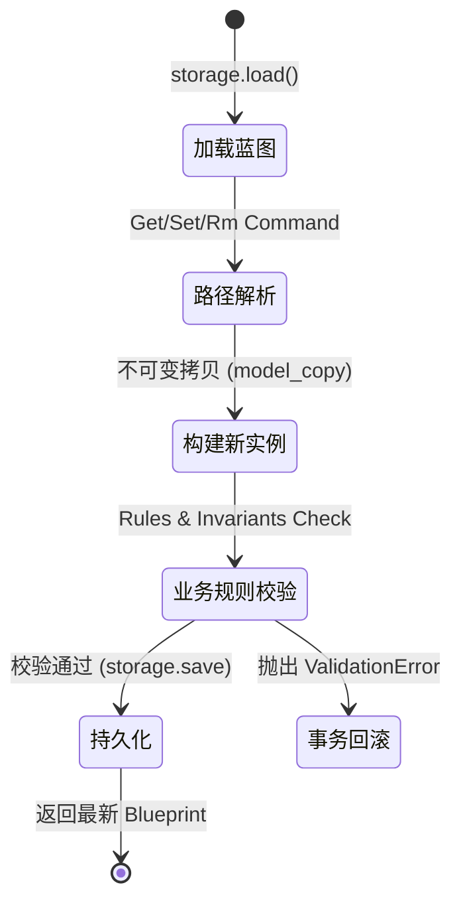

# DomainDefinition (领域定义) 上下文设计文档

## 1. 战略与通用语言 (Strategic & Ubiquitous Language)

### 1.1 核心职责与愿景
解析和管理领域定义蓝图（`codegen.yaml`），作为整个代码生成系统的**单一事实来源 (SSOT)**。负责将声明式的架构描述转化为可操作的领域模型，并具备“自我转换为下游模型”的能力，确保设计与代码实现强制同步。

### 1.2 通用语言词汇表
| 业务术语 | 英文对照 | 核心定义 |
| --- | --- | --- |
| **蓝图** | Blueprint | 整个项目的领域定义根容器，是代码生成的唯一输入源。 |
| **限界上下文** | Bounded Context | 系统的逻辑边界，拥有独立的领域模型和统一语言。 |
| **规范** | Spec | 领域构建块的描述性定义配置（如 EntitySpec, UseCaseSpec），本质上是充血的值对象。 |
| **顺从者** | Conformist | 一种上下文映射模式。DomainDefinition 必须顺从下游 PythonGen 的低阶模型定义进行转换。 |

---

## 2. 架构决策记录 (Architecture Decision Records - ADR)

### ADR-001: 采用充血模型赋予 Spec 自我转换能力
* **背景**：在早期设计中，将 YAML 蓝图转换为具体 Python 代码树的知识泄露在了 Orchestration 编排层，导致耦合严重。
* **决策**：将 DomainDefinition 确立为 PythonGen 的“顺从者 (Conformist)”。为所有 Spec（值对象）赋予 `to_module_spec()` 等行为方法。
* **影响**：转换逻辑沉淀在领域内部。DomainDefinition 知道自己如何被渲染为 PythonGen 的模型。

### ADR-002: 基于路径操作的 CQRS 模式
* **背景**：针对庞大 YAML 蓝图的细粒度操作（如 CLI/MCP 下发的 get, set, rm 命令）需要保证内存安全和单向数据流。
* **决策**：在应用层实施命令与查询分离 (CQRS)。
  * **命令 (Command)**: 使用 `BlueprintPathOperations` 进行不可变更新（Pydantic `model_copy`），完成 `load -> modify -> save` 的完整事务单元。
  * **查询 (Query)**: 直接通过 `BlueprintPathResolver` 领域服务解析路径取值，不触发持久化操作。

---

## 3. 核心算法与复杂业务流转 (Tactical Visualization)

### 3.1 蓝图修改 (SetValue/RemoveValue) 事务流转图
*注：该状态机展示了在 CQRS 架构下，针对单一聚合根 `Blueprint` 的不可变修改流转保证。*

