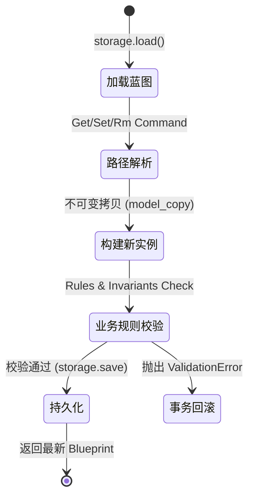

# DomainDefinition (领域定义) 上下文设计文档

## 1. 战略与通用语言 (Strategic & Ubiquitous Language)

### 1.1 核心职责与愿景
解析和管理领域定义蓝图（`codegen.yaml`），作为整个代码生成系统的**单一事实来源 (SSOT)**。负责将声明式的架构描述转化为可操作的领域模型，并具备“自我转换为下游模型”的能力，确保设计与代码实现强制同步。

### 1.2 通用语言词汇表
| 业务术语 | 英文对照 | 核心定义 |
| --- | --- | --- |
| **蓝图** | Blueprint | 整个项目的领域定义根容器，是代码生成的唯一输入源。 |
| **限界上下文** | Bounded Context | 系统的逻辑边界，拥有独立的领域模型和统一语言。 |
| **规范** | Spec | 领域构建块的描述性定义配置（如 EntitySpec, UseCaseSpec），本质上是充血的值对象。 |
| **顺从者** | Conformist | 一种上下文映射模式。DomainDefinition 必须顺从下游 PythonGen 的低阶模型定义进行转换。 |

### 1.3 DDD 战术分类层级
| 层级 | 领域元素 | 英文对照 | 分类性质 | 核心特征 |
| --- | --- | --- | --- | --- |
| 1 | **Blueprint** | Blueprint | **聚合根 (Aggregate Root)** | 系统全局唯一，封装 `codegen.yaml` 的完整生命周期与一致性边界，负责兜底所有跨上下文校验。 |
| 2 | **Context, AggregateSpec, EntitySpec, UseCaseSpec** | Context / AggregateSpec / EntitySpec / UseCaseSpec | **实体 (Entity)** | 从属于 Blueprint 聚合，拥有隐式局部身份标识（`name` 字段），在其生命周期内是可变的 (Mutable)。 |
| 3 | **Attribute, Rule, Dependency** | Attribute / Rule / Dependency | **值对象 (Value Object)** | 无概念身份标识，严格不可变 (Immutable)，任何修改本质为整体替换。 |

---

## 2. 架构决策记录 (Architecture Decision Records - ADR)

### ADR-001: 采用充血模型赋予 Spec 自我转换能力
* **背景**：在早期设计中，将 YAML 蓝图转换为具体 Python 代码树的知识泄露在了 Orchestration 编排层，导致耦合严重。
* **决策**：将 DomainDefinition 确立为 PythonGen 的“顺从者 (Conformist)”。为所有 Spec（值对象）赋予 `to_module_spec()` 等行为方法。
* **影响**：转换逻辑沉淀在领域内部。DomainDefinition 知道自己如何被渲染为 PythonGen 的模型。

### ADR-002: 基于路径操作的 CQRS 模式
* **背景**：针对庞大 YAML 蓝图的细粒度操作（如 CLI/MCP 下发的 get, set, rm 命令）需要保证内存安全和单向数据流。
* **决策**：在应用层实施命令与查询分离 (CQRS)。
  * **命令 (Command)**: 使用 `BlueprintPathOperations` 进行不可变更新（Pydantic `model_copy`），完成 `load -> modify -> save` 的完整事务单元。
  * **查询 (Query)**: 直接通过 `BlueprintPathResolver` 领域服务解析路径取值，不触发持久化操作。

### ADR-003: 确立 Blueprint 为全局单一聚合根并废弃泛型路径更新
* **背景**：之前系统倾向于将 Blueprint 视为嵌套字典，并使用泛型的 JSON Path 机制（`set_value`）进行深层更新。这不仅导致 Pydantic 的深层数据校验经常被绕过（产生脏数据），也使得业务意图（如"为实体添加属性"）在日志和工具调用中丢失，极易引发大语言模型产生幻觉。
* **决策**：
  1. 正式确立 `Blueprint` 为 DomainDefinition 上下文中的唯一聚合根。
  2. 废弃基于路径的泛型数据外科手术，转向"明确意图的命令 (Intent-Revealing Commands)"，如 `AddAttributeCommand`, `AddEntityCommand`。
  3. 所有针对深层实体（如 `EntitySpec`）和值对象（如 `Attribute`）的增删改，必须作为 Command 统一发送给 `Blueprint` 聚合根，由其内部通过 Name/ID 寻址并完成状态变更，最后统一触发一致性校验。
* **影响**：
  1. 后续必须重构现有的 `mcp__codegen__set` 工具，逐步拆分为强类型的具名工具。
  2. `BlueprintPathOperations` 将降级为仅供只读查询或非核心补漏使用的工具。

---

## 3. 核心算法与复杂业务流转 (Tactical Visualization)

### 3.1 蓝图修改 (SetValue/RemoveValue) 事务流转图
*注：该状态机展示了在 CQRS 架构下，针对单一聚合根 `Blueprint` 的不可变修改流转保证。*

