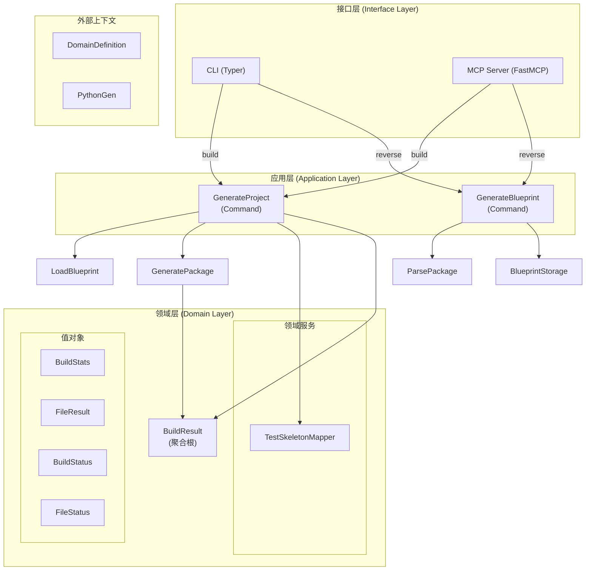
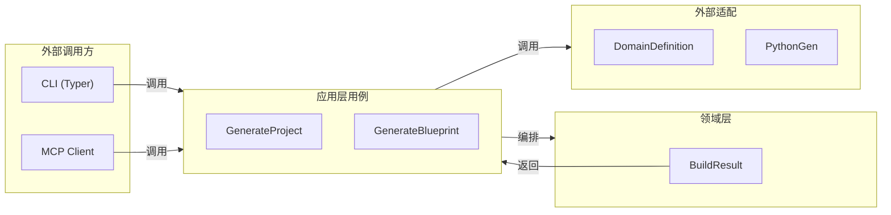
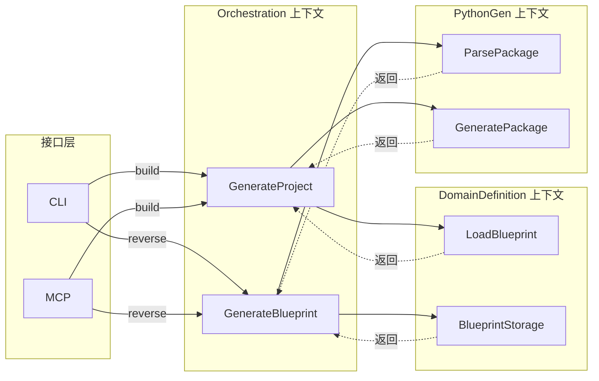

# Orchestration 限界上下文架构设计

## 前置条件

- 已审核锁定的战略设计文件：`docs/orchestration/ddd-strategic.md`
- 已审核锁定的战术建模文件：`docs/orchestration/ddd-tactical.md`

---

## 1. 应用层设计 (Application Layer)

### 用例编排 (Use Cases)

| 用例名称 | 中文名 | 核心逻辑 | 依赖的端口/聚合 | 事务边界 |
|---------|--------|---------|---------------|---------|
| **GenerateProject** | 生成项目 | Command 用例：编排 LoadBlueprint + GeneratePackage + TestSkeletonMapper。流程：① 加载蓝图 → ② 转换为 PackageSpec → ③ 生成代码 → ④ 生成测试骨架（如需要） | 依赖 `LoadBlueprint`（DomainDefinition）、`GeneratePackage`（PythonGen）、`TestSkeletonMapper` | 一次用例对应一个完整项目构建事务 |
| **GenerateBlueprint** | 生成蓝图 | Command 用例：编排 ParsePackage + BlueprintStorage。流程：① 解析 Python 包 → ② 转换为 Blueprint → ③ 保存到文件 | 依赖 `ParsePackage`（PythonGen）、`BlueprintStorage`（DomainDefinition） | 一次用例对应一个逆向工程事务 |

### 核心编排逻辑描述

**GenerateProject 执行流程**：
1. 调用 `LoadBlueprint.execute()` 加载 `codegen.yaml` 蓝图
2. 调用 `Blueprint.to_package_spec()` 将 Blueprint 转换为 PackageSpec
3. 调用 `GeneratePackage.execute()` 生成 Python 代码文件
4. 若 `generate_tests=True`，调用 `_generate_test_skeletons()` 生成测试骨架
5. 返回 `GenerateProjectResult(result: BuildResult)`

**GenerateBlueprint 执行流程**：
1. 调用 `ParsePackage.execute()` 解析 Python 包为 PackageSpec
2. 调用 `Blueprint.from_package_spec()` 将 PackageSpec 转换为 Blueprint
3. 调用 `BlueprintStorage.save()` 保存到 `codegen.yaml`
4. 返回 `GenerateBlueprintResult(result: str)`

### 命令与查询分离 (CQRS) 设计

| 命令/查询 | 名称 | 触发场景 | 修改聚合 | 输入参数 |
|----------|------|---------|---------|---------|
| **Command** | GenerateProjectCommand | `codegen build` | BuildResult（通过 GeneratePackage） | `overwrite`, `node`, `root_path`, `generate_tests` |
| **Command** | GenerateBlueprintCommand | `codegen reverse` | 无（只写 Blueprint 到文件） | `path: Path` |
| **Query** | LoadBlueprintQuery | 内部由 GenerateProject 调用 | 无 | `node: str | None` |
| **Result** | GenerateProjectResult | 返回 BuildResult | — | — |

### 事务与安全边界

- **事务范围**：一次 `GenerateProject` 用例对应整个项目的代码生成
- **原子性**：通过 `BuildResult` 追踪每个文件的生成状态，支持部分成功
- **最终一致性**：跨多个限界上下文的协调通过编排服务确保

---

## 2. 接口层设计 (Interface Layer)

### CLI（命令行接口）[属于 Orchestration 上下文]

**实现框架**：Typer

| CLI 命令 | 功能说明 | 参数列表 | 对应应用层用例 |
|---------|---------|---------|--------------|
| `codegen build` | 从 codegen.yaml 蓝图编译生成 Python 代码 | `--output`, `--overwrite`, `--node`, `--config`, `--generate-tests` | `GenerateProject` |
| `codegen reverse` | 逆向工程：将 Python 包解析为 codegen.yaml 蓝图 | `--config`, `--package` | `GenerateBlueprint` |

### MCP Server [属于 Orchestration 上下文]

**实现框架**：FastMCP

| MCP 工具 | 功能说明 | 对应应用层用例 |
|---------|---------|--------------|
| `codegen_build` | 构建项目 | `GenerateProject` |
| `codegen_reverse` | 逆向工程 | `GenerateBlueprint` |

### 契约设计 (Contracts/DTOs)

**实现框架**：Pydantic

| DTO 名称 | 类型 | 说明 |
|---------|------|------|
| **GenerateProjectCommand** | Pydantic Dataclass | 携带 `overwrite`, `node`, `root_path`, `generate_tests` 的命令对象 |
| **GenerateProjectResult** | Pydantic Dataclass | 携带 `result: BuildResult` 的结果对象 |
| **GenerateBlueprintCommand** | Pydantic Dataclass | 携带 `path: Path` 的命令对象 |
| **GenerateBlueprintResult** | Pydantic Dataclass | 携带 `result: str` 的结果对象 |

---

## 3. 基础设施层设计 (Infrastructure Layer)

### 端口与适配器映射 (Ports & Adapters Mapping)

| 领域层定义的 Port | 基础设施层 Adapter 实现 | 底层依赖 |
|-----------------|----------------------|---------|
| **无** | Orchestration 不直接定义端口 | 依赖注入通过构造函数实现 |

### 外部服务适配 (Adapters)

| 调用目标 | 说明 |
|---------|------|
| **DomainDefinition: LoadBlueprint** | 加载 codegen.yaml 蓝图 |
| **DomainDefinition: BlueprintStorage** | 保存/更新 codegen.yaml |
| **PythonGen: GeneratePackage** | 生成 Python 代码 |
| **PythonGen: ParsePackage** | 解析 Python 代码 |
| **Shared: FileSystemPort** | 操作系统文件系统（由 PythonGen 间接使用） |

### 技术组件落地

| 组件 | 技术选型 | 说明 |
|------|---------|------|
| **依赖注入容器** | `dependency-injector` | `DeclarativeContainer` + `Factory` provider |
| **CLI 框架** | `Typer` | 命令行接口框架 |
| **MCP 框架** | `FastMCP` | Model Context Protocol 服务器 |
| **输出格式化** | `Rich` | CLI 美化输出（表格、面板、进度条） |

---

## 4. 架构总览图

### Orchestration 上下文内部架构

### 六边形架构视角

### 上下文协作总览

---

## 修改记录

| 日期 | 修改人 | 修改内容 |
|------|--------|----------|
| 2026-03-20 | Claude | 逆向生成初始版本 |
