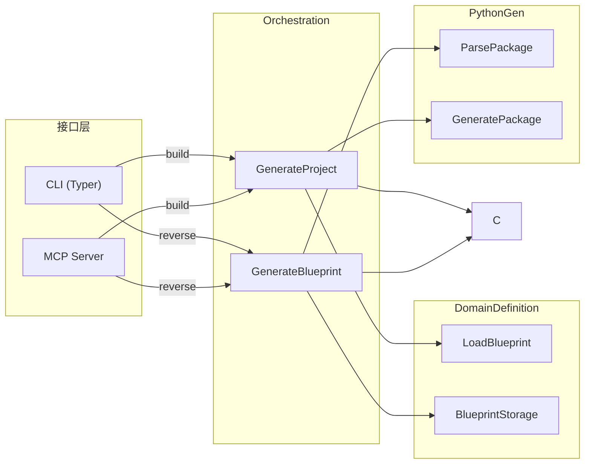

# Orchestration 限界上下文战略设计

## 1. 上下文命名与核心愿景 (Naming & Vision)

### 上下文名称 (Name)
**Orchestration** (编排协调器)

### 核心职责 (Core Responsibility)
作为 Codegen 工具的"总指挥"，Orchestration 上下文负责协调多个限界上下文（DomainDefinition、PythonGen）之间的协作，将用户意图（CLI 命令）转化为具体的跨上下文业务流程，同时提供构建结果的统一返回。

### 设计动机 (Design Motivation)

Codegen 工具涉及多个限界上下文的协作：
- **DomainDefinition**：提供蓝图定义（`codegen.yaml`）
- **PythonGen**：负责代码生成（PackageSpec → Python 文件）
- **CLI/MCP**：用户调用的接口

如果没有 Orchestration 上下文，CLI 接口层需要直接处理"加载蓝图 → 编排生成 → 处理结果"的全流程，导致接口层臃肿，违背单一职责原则。

因此，Orchestration 上下文的职责是：承担编排者角色，让 CLI/MCP 接口层只负责接收命令和格式化输出。

---

## 2. 统一语言词汇表 (Ubiquitous Language)

| 术语 | 中文名 | 业务定义 |
|------|--------|----------|
| Blueprint | 蓝图 | 代表 `codegen.yaml` 的完整结构，包含项目名称、描述、限界上下文列表 |
| BuildResult | 构建结果 | 代表代码生成的最终结果，包含状态、文件列表、统计信息 |
| BuildStats | 构建统计 | 文件计数统计（total/created/updated/skipped/failed） |
| FileResult | 文件结果 | 单个文件的生成结果（路径、状态、消息） |
| BuildStatus | 构建状态枚举 | SUCCESS / FAILURE / WARNING 三种状态 |
| FileStatus | 文件状态枚举 | CREATED / UPDATED / SKIPPED / FAILED 四种状态 |
| GenerateProject | 生成项目用例 | Command 用例：编排 LoadBlueprint + GeneratePackage |
| GenerateBlueprint | 生成蓝图用例 | Command 用例：编排 ParsePackage + UpdateBlueprint |

---

## 3. 上下文映射与集成 (Context Mapping)

### 协作关系

| 上下文 | 关系类型 | 描述 |
|--------|----------|------|
| **DomainDefinition** | 上游（蓝图定义） | 提供 `Blueprint`（codegen.yaml）的加载与保存 |
| **PythonGen** | 下游（代码生成） | 提供 `ParsePackage`（逆向）和 `GeneratePackage`（正向） |
| **Shared** | 依赖 | 使用 Shared 上下文的 `FileSystemPort` |
| **CLI/MCP** | 调用方 | CLI（MCP）接口调用 Orchestration 的用例 |

### 集成模式

- **开放主机服务 (OHS)**：`GenerateProject` 和 `GenerateBlueprint` 作为核心用例，暴露给 CLI/MCP 接口
- **防腐层 (ACL)**：通过 `Blueprint` 隔离 DomainDefinition 上下文，通过 `ParsePackage`/`GeneratePackage` 隔离 PythonGen 上下文
- **发布/订阅**：暂不涉及

### 上下文映射简图

### 关键设计决策

**编排而非执行**：
- `GenerateProject` 编排 `LoadBlueprint` 和 `GeneratePackage`，本身不执行业务逻辑
- `GenerateBlueprint` 编排 `ParsePackage` 和 `BlueprintStorage`，，本身不执行业务逻辑

**双向映射能力**：
- **正向**：`Blueprint` → `PackageSpec`（生成代码）：`Blueprint.to_package_spec()`
- **逆向**：`PackageSpec` → `Blueprint`（逆向工程）：`Blueprint.from_package_spec()`
- 映射逻辑由 `Blueprint` 值对象自身实现，属于 DomainDefinition 上下文的充血模型

---

## 修改记录

| 日期 | 修改人 | 修改内容 |
|------|--------|----------|
| 2026-03-20 | Claude | 逆向生成初始版本 |
| 2026-03-23 | Claude | 移除 Mapper 模式，映射逻辑下沉至 Blueprint 值对象的 `to_package_spec()` / `from_package_spec()` 方法 |
