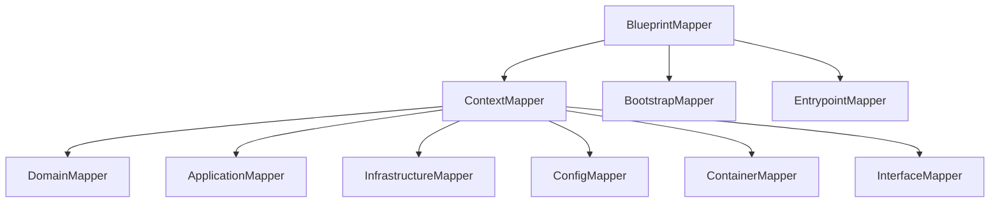

# Orchestration 限界上下文战术设计

## 前置条件

- 已审核锁定的战略设计文件：`docs/orchestration/ddd-strategic.md`
- 战略设计核心目标：编排多个限界上下文的协作，将 CLI 命令转化为跨上下文业务流程

---

## 1. 聚合与聚合根 (Aggregates & Aggregate Roots)

### 聚合划分原则

**基于业务流程一致性的聚合划分**：
- Orchestration 上下文的核心职责是编排而非领域建模
- 其主要实体是"用例"（Use Case），负责协调多个上下文的操作
- **事务边界**：`BuildResult` 作为构建结果的聚合根，确保整个构建结果的状态一致性

### 聚合根列表

| 聚合根名称 | 中文名 | 核心职责 | 一致性边界说明 |
|-----------|--------|----------|---------------|
| **BuildResult** | 构建结果 | 代表代码生成的最终结果。管理 `files`（文件结果列表）、`stats`（统计信息）、`status`（最终状态）。提供 `add_file_result()` 方法累积文件生成结果 | 整个构建过程作为一致性边界；单个文件失败不影响其他文件，但会导致最终状态为 WARNING |

### 聚合关系

```mermaid
graph TB
    subgraph BuildResult (聚合根)
        A["status: BuildStatus"]
        B["files: list[FileResult]"]
        C["stats: BuildStats"]
        D["messages: list[str]"]
    end

    subgraph FileResult
        E["path: str"]
        F["status: FileStatus"]
        G["message: str | None"]
    end

    subgraph BuildStats
        H["total_files: int"]
        I["created_count: int"]
        J["updated_count: int"]
        K["skipped_count: int"]
        L["failed_count: int"]
        M["duration_ms: int"]
    end

    BuildResult --> B
    BuildResult --> C
    BuildResult --> A
    BuildResult --> D
    B --> FileResult
    C --> BuildStats
```

---

## 2. 值对象 (Value Objects)

> Orchestration 上下文中所有领域对象均为值对象，无实体。

| 值对象名称 | 所属聚合/实体 | 核心属性 | 不可变性规则 | 业务校验规则 |
|-----------|-------------|---------|-------------|-------------|
| **FileResult** | BuildResult | `path: str`, `status: FileStatus`, `message: str \| None` | 只读，创建后不可变更 | 代表单个文件的生成结果；通过 `BuildResult.add_file_result()` 收集到结果列表中 |
| **BuildStatus** | BuildResult | `value: str` | 只读枚举 | SUCCESS / FAILURE / WARNING 三选一；WARNING 表示部分成功 |
| **FileStatus** | FileResult | `value: str` | 只读枚举 | CREATED / UPDATED / SKIPPED / FAILED 四选一 |
| **BuildStats** | BuildResult | `total_files`, `created_count`, `updated_count`, `skipped_count`, `failed_count`, `duration_ms` | 设计上应为不可变值对象（代码中为实现方便配置 `frozen=False`） | 通过 `add_result()` 方法根据 FileResult 递增计数 |

**为何 FileResult 是值对象**：
- FileResult 是不可变对象，创建后不可修改
- `BuildResult.add_file_result()` 接收 FileResult 并将其加入列表，不修改 FileResult 本身
- 虽然通过 `path` 唯一标识文件，但 FileResult 本身没有身份生命周期概念，符合值对象特征

### 补充定义（来自战术建模阶段）

| 补充术语 | 中文名 | 补充定义 |
|---------|--------|---------|
| **BlueprintMapper** | 蓝图映射器 | 补充自应用层服务，作为编排服务负责 Blueprint ↔ PackageSpec 双向转换 |
| **ContextMapper** | 上下文映射器 | 补充自应用层服务，负责单个 BoundedContext → PackageSpec |

---

## 3. 领域事件 (Domain Events)

**分析结论**：当前 Orchestration 上下文中**不存在领域事件**。

**理由**：
- Orchestration 是编排型上下文，负责协调而非决策
- 代码生成是同步的、确定性的流程
- 构建结果通过 `BuildResult` 直接返回，不通过事件传播
- 不存在需要跨限界上下文传播的"业务状态变更"

---

## 4. 领域服务 (Domain Services)

| 服务名称 | 中文名 | 核心逻辑 | 依赖聚合 | 无状态说明 |
|---------|--------|---------|---------|-----------|
| **BlueprintMapper** | 蓝图映射器 | 双向映射：① `to_package_spec(blueprint) → PackageSpec`（生成代码）；② `to_blueprint(package_spec) → Blueprint`（逆向工程）。协调 ContextMapper、BootstrapMapper、EntrypointMapper | 无直接依赖聚合 | **无状态**：仅做转换逻辑 |
| **ContextMapper** | 上下文映射器 | 将单个 BoundedContext 转换为 PackageSpec。协调 DomainMapper、ApplicationMapper、InfrastructureMapper、ContainerMapper、InterfaceMapper | 无直接依赖聚合 | **无状态**：仅做转换逻辑 |
| **TestSkeletonMapper** | 测试骨架映射器 | 生成单元测试骨架文件 | 无直接依赖聚合 | **无状态**：仅做转换逻辑 |

### 服务编排关系



---

## 5. 领域端口 (Domain Ports)

**分析结论**：Orchestration 上下文中**不存在领域端口 (Domain Ports)**。

**理由**：
- Orchestration 是编排型上下文，不直接与外部世界交互
- 依赖注入通过构造函数参数实现（如 `GenerateProject(loader, generator, test_generator, mapper)`）
- CLI 调用直接调用用例的 `execute()` 方法，不通过端口抽象

### 补充说明（来自架构设计阶段）

Orchestration 依赖其他上下文的端口：
- **PythonGen 的 `SourceCodePort`**：通过 `AstTranslator` 实现
- **PythonGen 的 `CodeFormatter`**：通过 `BlackCodeFormatter` 实现
- **DomainDefinition 的 `BlueprintStorage`**：通过文件存储实现

---

## 修改记录

| 日期 | 修改人 | 修改内容 |
|------|--------|----------|
| 2026-03-20 | Claude | 逆向生成初始版本 |
