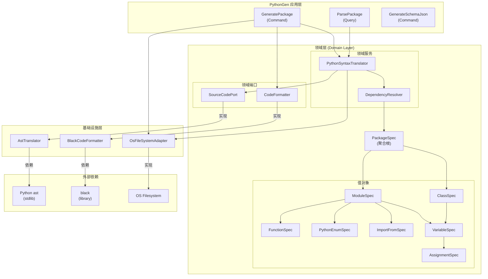
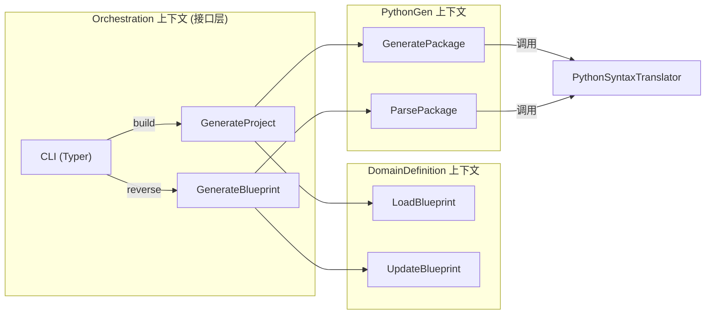
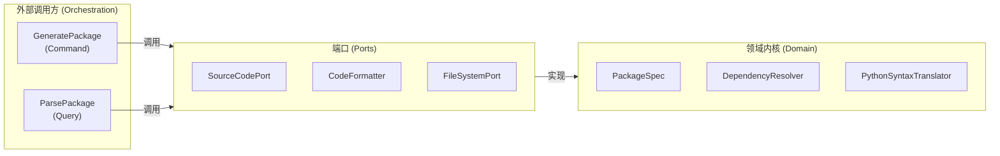

# PythonGen 限界上下文架构设计

> **说明**：本文档描述 **PythonGen** 上下文的内部架构。CLI 接口（`codegen build` / `codegen reverse`）属于 **Orchestration** 上下文，不在本文档范围内。

## 前置条件

- 已审核锁定的战略设计文件：`docs/python_gen/ddd-strategic.md`
- 已审核锁定的战术建模文件：`docs/python_gen/ddd-tactical.md`

---

## 1. 应用层设计 (Application Layer)

### 用例编排 (Use Cases)

| 用例名称 | 中文名 | 核心逻辑 | 依赖的端口/聚合 | 事务边界 |
|---------|--------|---------|---------------|---------|
| **ParsePackage** | 解析包 | Query 用例：将 Python 包目录逆向解析为 PackageSpec。调用 `PythonSyntaxTranslator.to_package_spec()` 遍历文件并解析 | 依赖 `PythonSyntaxTranslator`（持有 `SourceCodePort`） | 读取操作，无写事务 |
| **GeneratePackage** | 生成包 | Command 用例：将 PackageSpec 生成为 Python 源码文件树并写入磁盘。流程：① 合并已存在包 → ② 生成虚拟文件树 → ③ 格式化代码 → ④ 写入文件 | 依赖 `PythonSyntaxTranslator`、`CodeFormatter`、`FileSystemPort` | 一次用例修改一个 PackageSpec 聚合根 |
| **GenerateSchemaJson** | 生成 Schema JSON | Command 用例：将 PackageSpec 序列化为 JSON Schema | 依赖 `FileSystemPort` | 无聚合修改 |

### 核心编排逻辑描述

**GeneratePackage 执行流程**：
1. 通过 `FileSystemPort` 检查目标目录是否存在
2. 若存在，执行 `PythonSyntaxTranslator.to_package_spec()` 读取已有包结构
3. 调用 `PackageSpec.merge()` 合并新旧 Spec
4. 调用 `PythonSyntaxTranslator.generate_source_tree()` 生成虚拟文件树 `{Path: str}`
5. 遍历文件树：对每个文件调用 `CodeFormatter.format_code()` 格式化
6. 调用 `FileSystemPort.write_file()` 写入文件系统
7. 返回 `BuildResult`（包含每个文件的 CREATED/UPDATED/SKIPPED/FAILED 状态）

### 命令与查询分离 (CQRS) 设计

| 命令/查询 | 名称 | 触发场景 | 修改聚合 | 输入参数 |
|----------|------|---------|---------|---------|
| **Command** | GeneratePackageCommand | `codegen build` 或 `codegen generate` | PackageSpec（生成文件但聚合本身不变） | `package_spec`, `overwrite`, `node`, `root_path` |
| **Command** | GenerateSchemaJsonCommand | `codegen schema` | 无 | 无 |
| **Query** | ParsePackageQuery | `codegen reverse` 或逆向解析需求 | 无（只读） | `package_path: Path` |
| **Query** | ParsePackageResult | 返回 PackageSpec | PackageSpec（重建） | — |

**CQRS 实现策略**：
- 命令和查询完全分离，使用独立的 Command/Query 对象
- `GeneratePackage` 是 Command，通过领域服务修改聚合后写文件
- `ParsePackage` 是 Query，仅调用 `to_package_spec()` 读取文件系统，不产生副作用

### 事务与安全边界

- **事务范围**：一次 `GeneratePackage` 用例对应一次完整文件生成操作
- **原子性**：通过 `BuildResult` 追踪每个文件的生成状态，支持部分成功
- **最终一致性**：跨多个文件（模块）的生成通过 `PackageSpec.merge()` 确保符号表一致性

---

## 2. 接口层设计 (Interface Layer)

> **说明**：PythonGen 上下文本身不直接暴露接口，所有接口由 **Orchestration** 上下文统一暴露。
>
> 编排流程：
> - `codegen build` → `GenerateProject` → `LoadBlueprint`(DomainDefinition) + `GeneratePackage`(PythonGen)
> - `codegen reverse` → `GenerateBlueprint` → `ParsePackage`(PythonGen) + `UpdateBlueprint`(DomainDefinition)

### 契约设计 (Contracts/DTOs)

**实现框架**：Pydantic（但 PythonGen 内部使用 `ValueObject` 子类作为 DTO，不直接使用 Pydantic DTO）

| DTO 名称 | 类型 | 说明 |
|---------|------|------|
| **GeneratePackageCommand** | Pydantic Dataclass | 携带 `package_spec`、`overwrite`、`node`、`root_path` 的命令对象 |
| **GeneratePackageResult** | Pydantic Dataclass | 携带 `result: BuildResult` 的结果对象 |
| **ParsePackageQuery** | Pydantic Dataclass | 携带 `package_path: Path` 的查询对象 |
| **ParsePackageResult** | Pydantic Dataclass | 携带 `package_spec: PackageSpec` 的结果对象 |

---

## 3. 基础设施层设计 (Infrastructure Layer)

### 端口与适配器映射 (Ports & Adapters Mapping)

| 领域层定义的 Port | 基础设施层 Adapter 实现 | 底层依赖 |
|-----------------|----------------------|---------|
| **SourceCodePort** | `AstTranslator` | Python `ast` 模块（`ast.parse` + `ast.unparse`） |
| **CodeFormatter** | `BlackCodeFormatter` | `black` 库 |
| **FileSystemPort** | `OsFileSystemAdapter` | Python 标准库 `pathlib` / `os` |

### 外部服务适配 (Adapters)

**补充自架构设计阶段**：

| Port | 实现 | 说明 |
|------|------|------|
| **FileSystemPort**（来自 Shared 上下文） | `OsFileSystemAdapter` | 操作系统文件系统适配器 |

### 技术组件落地

| 组件 | 技术选型 | 说明 |
|------|---------|------|
| **依赖注入容器** | `dependency-injector` | `DeclarativeContainer` + `Factory` provider |
| **AST 解析/渲染** | Python `ast` 模块 | 标准库，无需额外依赖 |
| **代码格式化** | `black` | Python 代码格式化工具 |
| **文件系统抽象** | `pathlib.Path` | 标准库跨平台路径操作 |

---

## 4. 架构总览图

### PythonGen 上下文内部架构

### Orchestration 与 PythonGen 的上下文调用关系

### 六边形架构视角（PythonGen 内部）

---

## 修改记录

| 日期 | 修改人 | 修改内容 |
|------|--------|----------|
| 2026-03-20 | Claude | 逆向生成初始版本 |
