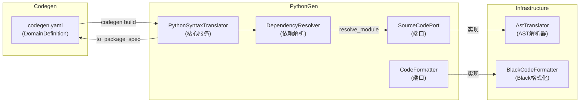

# PythonGen 限界上下文战略设计

## 1. 上下文命名与核心愿景 (Naming & Vision)

### 上下文名称 (Name)
**PythonGen** (Python Code Generator)

### 核心职责 (Core Responsibility)
将 Python 源代码与结构化领域模型（PackageSpec、ModuleSpec 等）进行双向转换，并通过依赖解析与代码格式化生成符合规范的 Python 代码。

### 问题陈述 (Problem Statement)
Codegen 项目需要在 `codegen.yaml` 蓝图定义与实际 Python 源码之间建立一座桥梁。原始的 DomainDefinition 上下文定义了 DDD 结构，但最终需要生成可执行的 Python 代码。PythonGen 上下文承担了这一职责：它既是"逆向工程器"（将现有 Python 代码解析为结构化模型），也是"代码生成器"（将结构化模型渲染为高质量 Python 代码）。

---

## 2. 统一语言词汇表 (Ubiquitous Language)

| 术语 | 中文名 | 业务定义 |
|------|--------|----------|
| PackageSpec | 包规格 | 代表一个 Python 包（含 modules 和 sub_packages）的顶层规格 |
| ModuleSpec | 模块规格 | 代表一个 Python `.py` 文件的规格，含 classes/functions/enums/imports |
| ClassSpec | 类规格 | 代表 Python 类，含名称、描述、装饰器、继承、属性、方法 |
| FunctionSpec | 函数规格 | 代表 Python 函数，含名称、参数、返回值注解、函数类型（classmethod/static/instance/function） |
| PythonEnumSpec | 枚举规格 | 代表 Python 枚举类及其成员 |
| VariableSpec | 变量规格 | 对应 `name: type_spec = assignment_spec` 的变量声明 |
| AssignmentSpec | 赋值规格 | 描述变量的 RHS 值结构（字面量/引用/调用/列表/字典/原始代码） |
| TypeAnnotationSpec | 类型注解规格 | 描述类型注解结构（名称、参数容器） |
| ImportFromSpec | 导入规格 | 代表 `from module import names` 语句 |
| DependencyResolver | 依赖解析器 | 根据全局注册表解析模块所需的所有导入依赖 |
| SourceCodePort | 源码端口 | Spec 对象与 Python 源码之间双向翻译的端口抽象 |
| CodeFormatter | 代码格式化器 | 格式化 Python 源码的端口抽象（使用 Black） |
| AssignmentFlavor | 赋值风格枚举 | 区分 NONE/LITERAL/SYMBOL/CALL/DICT/LIST/RAW_CODE/CODE 八种赋值类型 |
| FunctionType | 函数类型枚举 | 区分 CLASS_METHOD/STATIC_METHOD/INSTANCE_METHOD/FUNCTION 四种函数类型 |
| FieldFlavor | 字段风格枚举 | 区分 PYDANTIC/DATACLASS 两种字段建模风格 |

---

## 3. 上下文映射与集成 (Context Mapping)

### 协作关系

PythonGen 上下文与以下限界上下文存在上下游协作关系：

| 上下文 | 关系类型 | 描述 |
|--------|----------|------|
| **DomainDefinition** | 上游（被解析） | PythonGen 接收 DomainDefinition 上下文定义的蓝图结构（通过 PackageSpec 输入），生成对应的 Python 源码 |
| **Shared** | 依赖 | 通过 FileSystemPort 依赖 Shared 上下文的文件系统抽象 |
| **Orchestration** | 调用方 | Orchestration 上下文编排 PythonGen 的用例完成代码生成 |

### 集成模式

- **开放主机服务 (OHS)**：PythonSyntaxTranslator 作为核心服务，提供 `to_package_spec`（逆向）和 `generate_source_tree`（正向）两个开放接口
- **防腐层 (ACL)**：通过 SourceCodePort 和 FileSystemPort 隔离外部依赖，避免直接耦合文件系统或 AST 库
- **发布/订阅**：暂不涉及

### 上下文映射简图

### 关键设计决策

**双向转换是核心能力**：
- **正向**：`PackageSpec` → Python 源码文件树（用于代码生成）
- **逆向**：Python 源码 → `PackageSpec`（用于逆向工程和蓝图同步）

**依赖解析策略**：
- 维护 `GLOBAL_REGISTRY` 内置类型到模块路径的映射（如 `Field → pydantic`、`BaseModel → pydantic`）
- 支持从 `PackageSpec` 动态构建局部注册表
- 自动为每个 ModuleSpec 补全所需的 `import` 语句

**AST 翻译隔离**：
- 所有 AST 操作封装在 `AstTranslator` 适配器中
- 领域层通过 `SourceCodePort` 端口与 AST 解耦
- 支持未来替换为其他 Parser 实现（如 ` libcst`、`astor`）

---

## 修改记录

| 日期 | 修改人 | 修改内容 |
|------|--------|----------|
| 2026-03-20 | Claude | 逆向生成初始版本 |
