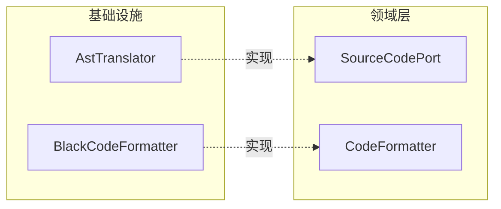

# PythonGen 限界上下文战术设计

## 前置条件

- 已审核锁定的战略设计文件：`docs/python_gen/ddd-strategic.md`
- 战略设计核心目标：将 Python 源代码与结构化领域模型（PackageSpec、ModuleSpec 等）进行双向转换

---

## 1. 聚合与聚合根 (Aggregates & Aggregate Roots)

### 聚合划分原则

**基于代码生成一致性边界的聚合划分**：
- PythonGen 上下文的核心职责是生成完整的 Python 源码文件树
- 一个 `PackageSpec` 对应一个 Python 包目录（含 `__init__.py` 和若干模块文件）
- 一个 `ModuleSpec` 对应一个 `.py` 文件
- **事务边界**：PackageSpec 作为聚合根，确保整个包级别的代码生成原子性（要么全生成，要么全不生成）

### 聚合根列表

| 聚合根名称 | 中文名 | 核心职责 | 一致性边界说明 |
|-----------|--------|----------|---------------|
| **PackageSpec** | 包规格 | 代表一个 Python 包，是代码生成的顶层入口。管理 modules 和 sub_packages，提供全局符号表构建、包级别合并、类规格收集 | 整个 Python 包目录作为一致性边界；子包和模块的生成必须与父包保持一致 |

### 聚合关系

```mermaid
graph TB
    subgraph PackageSpec (聚合根)
        A["modules: list[ModuleSpec]"]
        B["sub_packages: list[PackageSpec]"]
    end

    subgraph ModuleSpec
        C["classes: list[ClassSpec]"]
        D["functions: list[FunctionSpec]"]
        E["enums: list[PythonEnumSpec]"]
        F["imports: list[ImportFromSpec]"]
        G["assignments: list[ModuleAssignmentSpec]"]
        H["extra_code: list[RawCodeSpec]"]
    end

    PackageSpec --> A
    PackageSpec --> B
    A --> C
    A --> D
    A --> E
    A --> F
    A --> G
    A --> H
```

**说明**：
- `PackageSpec` 是唯一聚合根，包含 `modules` 和 `sub_packages`
- `ModuleSpec` 不是聚合根，而是 `PackageSpec` 的组成部分（Entity within aggregate）
- `sub_packages` 是递归包含的 `PackageSpec`，形成树形结构

---

## 2. 实体与值对象 (Entities & Value Objects)

### 实体 (Entities)

| 实体名称 | 所属聚合 | 唯一标识 | 核心属性 | 业务规则 |
|---------|---------|---------|---------|---------|
| **ModuleSpec** | PackageSpec | `name: SnakeString` | `functions`, `classes`, `enums`, `imports`, `assignments`, `extra_code` | 模块名唯一性（同一包内）；支持 merge 合并同名模块 |

**为何是实体而非值对象**：
- `ModuleSpec` 具有全局唯一标识（`name`），不同 `name` 的 ModuleSpec 代表不同的 Python 文件
- `ModuleSpec` 具有独立生命周期，可独立存在、可合并（merge 操作）
- 模块内容可变（添加/删除类、函数），但标识不变

### 值对象 (Value Objects)

| 值对象名称 | 所属聚合/实体 | 核心属性 | 不可变性规则 | 业务校验规则 |
|-----------|-------------|---------|-------------|-------------|
| **ClassSpec** | ModuleSpec | `name`, `description`, `decorators`, `inheritance`, `attributes`, `methods` | 所有字段只读，创建后不可变 | `name` 必须为 PascalString；`inheritance` 为基类名称列表；提供 `create_value_object()` / `create_entity()` / `create_aggregate()` 工厂方法 |
| **FunctionSpec** | ModuleSpec | `name`, `decorators`, `parameters`, `return_annotation`, `suite`, `function_type`, `is_private` | 所有字段只读 | `name` 必须为 SnakeString；`function_type` 枚举限制为 CLASS_METHOD/STATIC_METHOD/INSTANCE_METHOD/FUNCTION；提供 `is_instance_method()` / `is_init_method()` 行为方法 |
| **PythonEnumSpec** | ModuleSpec | `name`, `description`, `decorators`, `base_class`, `members` | `members` 列表不可变 | `base_class` 默认为 "Enum"；`members` 为 `PythonEnumMemberSpec` 列表 |
| **VariableSpec** | ClassSpec/FunctionSpec | `name`, `type_spec`, `assignment` | 所有字段只读 | 表示 `name: type_spec = assignment_spec` 结构；`get_required_types()` 收集依赖类型 |
| **AssignmentSpec** | VariableSpec | `flavor`, `literal`, `reference`, `call`, `list_items`, `dict_items`, `code` | 所有字段只读 | `flavor` 区分 NONE/LITERAL/SYMBOL/CALL/DICT/LIST/RAW_CODE/CODE 八种类型；通过工厂方法 `from_code()` / `from_literal()` / `from_symbol()` / `from_call()` 创建 |
| **TypeAnnotationSpec** | VariableSpec | `name`, `args` | 所有字段只读 | 表示类型注解结构；提供 `render()` 渲染为字符串；`get_all_referenced_names()` 收集所有引用的类型名 |
| **ImportFromSpec** | ModuleSpec | `module`, `names`, `type_checking`, `level` | `names` 为 frozenset 不可变集合 | 表示 `from module import names`；支持 `add_name()` 返回新实例；`render()` 渲染为 Python import 语句 |
| **ImportedName** | ImportFromSpec | `name`, `alias` | 所有字段只读 | 表示单个导入的名称；`render()` 输出 `name` 或 `name as alias` |
| **ReferenceSpec** | AssignmentSpec | `name` | 只读 | 表示对变量的引用（AST Name 节点） |
| **LiteralSpec** | AssignmentSpec | `value` | 只读 | 表示字面量值（AST Constant 节点） |
| **CallSpec** | AssignmentSpec | `callee`, `args`, `kwargs` | 只读 | 表示函数调用（AST Call 节点） |
| **PythonEnumMemberSpec** | PythonEnumSpec | `name`, `value`, `description` | 只读 | 表示枚举成员；`name` 为 MacroString（常量格式） |
| **ModuleAssignmentSpec** | ModuleSpec | `name`, `value`, `type_annotation` | 只读 | 表示模块级赋值语句 |
| **RawCodeSpec** | ModuleSpec | `code` | 只读 | 表示原始代码块（直接嵌入） |

### 补充定义（来自战术建模阶段）

| 补充术语 | 中文名 | 补充定义 |
|---------|--------|---------|
| **ContainerType** | 容器类型枚举 | 补充自 TypeSpec，用于区分类型容器类型（list/dict/optional/none） |
| **MacroString** | 宏字符串 | 补充自 PythonEnumMemberSpec.name，用于标识枚举常量（全大写） |

---

## 3. 领域事件 (Domain Events)

**分析结论**：当前 PythonGen 上下文中**不存在领域事件**。

**理由**：
- PythonGen 是纯生成型上下文，负责将结构化模型转换为代码
- 其核心流程（解析→转换→生成）是同步的、确定性的
- 不存在需要跨限界上下文传播的"业务状态变更"
- 依赖解析（DependencyResolver）属于领域服务操作，不产生事件

---

## 4. 领域服务 (Domain Services)

| 服务名称 | 中文名 | 核心逻辑 | 依赖聚合 | 无状态说明 |
|---------|--------|---------|---------|-----------|
| **DependencyResolver** | 依赖解析器 | 根据全局注册表（类型→模块路径映射）解析模块所需的所有 ImportFromSpec | 依赖 PackageSpec 构建符号表 | **无状态**：仅通过 `global_registry` 字典查询；`build_from_package_spec()` 工厂方法创建实例 |
| **PythonSyntaxTranslator** | Python 语法翻译器 | 双向翻译：① `to_package_spec()` 将 Python 源码目录逆向解析为 PackageSpec；② `generate_source_tree()` 将 PackageSpec 正向生成为虚拟文件树 | 依赖 SourceCodePort 和 FileSystemPort | **有状态**：持有端口依赖；`to_package_spec()` 和 `generate_source_tree()` 存在副作用（IO 操作） |

---

## 5. 领域端口 (Domain Ports)

### 核心定义

领域层通过端口抽象与外部世界交互：
- **SourceCodePort**：隔离 AST 解析/渲染实现，支持未来替换为 libcst、astor 等
- **CodeFormatter**：隔离代码格式化实现，支持未来替换为 ruff、autopep8 等

### 端口列表

| 端口名称 | 中文名 | 核心契约职责 | 抽象级别 |
|---------|--------|-------------|---------|
| **SourceCodePort** | 源码端口 | `render_module(module_spec, imports) → str`：将 ModuleSpec 渲染为 Python 源码字符串；`parse_module(source_code, module_name) → ModuleSpec`：将 Python 源码解析为 ModuleSpec | 领域层端口（ABC），由 AstTranslator 基础设施实现 |
| **CodeFormatter** | 代码格式化器 | `format_code(code) → str`：接收源码字符串，返回格式化后的源码 | 领域层端口（ABC），由 BlackCodeFormatter 基础设施实现 |

### 端口与基础设施实现关系



---

## 修改记录

| 日期 | 修改人 | 修改内容 |
|------|--------|----------|
| 2026-03-20 | Claude | 逆向生成初始版本 |
