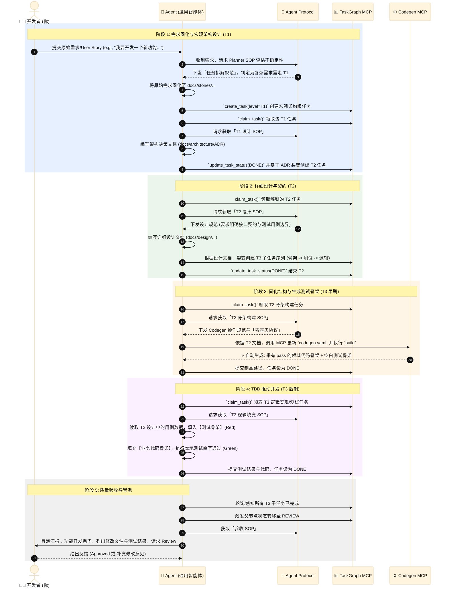

```mermaid
%%{init: { 'theme': 'base', 'themeVariables': { 'primaryTextColor': '#111', 'lineColor': '#333', 'actorTextColor': '#111', 'signalTextColor': '#111', 'noteTextColor': '#000' } } }%%
sequenceDiagram
    autonumber
    actor User as 👨‍💻 开发者 (你)
    participant Agent as 🤖 Agent (通用智能体)
    participant AP as 📜 Agent Protocol
    participant TG as 📊 TaskGraph MCP
    participant CG as ⚙️ Codegen MCP

    %% --- Phase 1: 需求固化与宏观架构 (T1 Level) ---
    rect rgb(230, 240, 255)
    Note over User, TG: 阶段 1: 需求固化与宏观架构设计 (T1)
    User->>Agent: 提交原始需求/User Story (e.g., "我要开发一个新功能...")
    Agent->>AP: 收到需求，请求 Planner SOP 评估不确定性
    AP-->>Agent: 下发「任务拆解规范」，判定为复杂需求需走 T1
    Agent->>Agent: 将原始需求固化至 docs/stories/...
    Agent->>TG: `create_task(level=T1)` 创建宏观架构根任务
    Agent->>TG: `claim_task()` 领取该 T1 任务
    Agent->>AP: 请求获取「T1 设计 SOP」
    Agent->>Agent: 编写架构决策文档 (docs/architecture/ADR)
    Agent->>TG: `update_task_status(DONE)` 并基于 ADR 裂变创建 T2 任务
    end

    %% --- Phase 2: 详细设计与契约 (T2 Level) ---
    rect rgb(235, 245, 235)
    Note over Agent, TG: 阶段 2: 详细设计与契约 (T2)
    Agent->>TG: `claim_task()` 领取解锁的 T2 任务
    Agent->>AP: 请求获取「T2 设计 SOP」
    AP-->>Agent: 下发设计规范 (要求明确接口契约与测试用例边界)
    Agent->>Agent: 编写详细设计文档 (docs/design/...)
    Agent->>TG: 根据设计文档，裂变创建 T3 子任务序列 (骨架 -> 测试 -> 逻辑)
    Agent->>TG: `update_task_status(DONE)` 结束 T2
    end

    %% --- Phase 3: 骨架与测试生成 (T3 Phase 1) ---
    rect rgb(255, 245, 230)
    Note over Agent, CG: 阶段 3: 固化结构与生成测试骨架 (T3 早期)
    Agent->>TG: `claim_task()` 领取 T3 骨架构建任务
    Agent->>AP: 请求获取「T3 骨架构建 SOP」
    AP-->>Agent: 下发 Codegen 操作规范与「零容忍协议」
    Agent->>CG: 依据 T2 文档，调用 MCP 更新 `codegen.yaml` 并执行 `build`
    CG-->>Agent: ⚡️ 自动生成: 带有 pass 的领域代码骨架 + 空白测试骨架
    Agent->>TG: 提交制品路径，任务设为 DONE
    end

    %% --- Phase 4: TDD 驱动开发 (T3 Phase 2 & 3) ---
    rect rgb(250, 240, 255)
    Note over Agent, TG: 阶段 4: TDD 驱动开发 (T3 后期)
    Agent->>TG: `claim_task()` 领取 T3 逻辑实现/测试任务
    Agent->>AP: 请求获取「T3 逻辑填充 SOP」
    Agent->>Agent: 读取 T2 设计中的用例数据，填入【测试骨架】(Red)
    Agent->>Agent: 填充【业务代码骨架】，执行本地测试直至通过 (Green)
    Agent->>TG: 提交测试结果与代码，任务设为 DONE
    end

    %% --- Phase 5: 验收与冒泡 ---
    rect rgb(240, 240, 240)
    Note over User, Agent: 阶段 5: 质量验收与冒泡
    Agent->>TG: 轮询/感知所有 T3 子任务已完成
    Agent->>TG: 触发父节点状态转移至 REVIEW
    Agent->>AP: 获取「验收 SOP」
    Agent->>User: 冒泡汇报：功能开发完毕，列出修改文件与测试结果，请求 Review
    User-->>Agent: 给出反馈 (Approved 或 补充修改意见)
    end
```